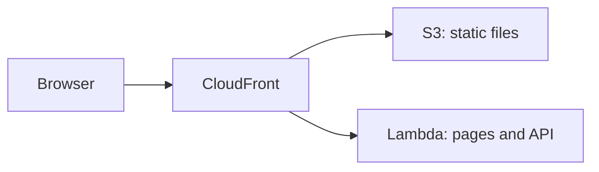

# AWS Lambda

<Badge label="Beta" color="orange" icon="rocket" />

AWS Lambda runs your app's server on demand, so there is no server to set up or
keep running. A Lambda function does not serve the app's static files, though,
so this guide uses three AWS services together:

- **AWS Lambda** runs the app's server, which handles its pages and API.
- **Amazon S3** stores the app's static files, such as JavaScript, CSS, and
  images.
- **Amazon CloudFront** gives the app one public address with HTTPS and sends
  each request to the right place.



This guide walks through deploying one standalone app from scratch. You will
create the app, give it a production database and an auth secret, prepare the
database, build it for Lambda, create the function, upload the static files,
and then put CloudFront in front of both.

<Callout tone="info">

Node.js `22.22+` is required.

</Callout>

You also need an AWS account and the [AWS CLI](https://docs.aws.amazon.com/cli/latest/userguide/getting-started-install.html)
installed and signed in on your computer, with a default region set. Run the
commands in this guide on your own computer. Steps 5 and 6 use the AWS CLI, and
Step 7 uses the CloudFront console.

## Step 1: Create the app

Create your new standalone app. The example below creates an app from the Chat
template, but you can start from any template. Move into the app's folder and
install its dependencies. `corepack enable` turns on the `pnpm` version the app
expects, so you do not need to install `pnpm` yourself.

```bash
npx --yes @agent-native/core@latest create my-app --standalone --template chat

cd my-app

corepack enable

pnpm install
```

Replace `my-app` with your own app name if you like. The rest of this guide
assumes you are inside the app's folder.

<Callout tone="info">

If these commands fail with peer dependency errors, an outdated copy of a
package in your npx cache may be the cause. Run `npx clear-npx-cache` to clear
the cache, then run the commands again.

</Callout>

## Step 2: Configure environment secrets

The app reads its production settings from environment variables:

| Variable             | Required | Purpose                                              |
| -------------------- | -------- | ---------------------------------------------------- |
| `DATABASE_URL`       | Yes      | Connects the app to its PostgreSQL database          |
| `BETTER_AUTH_SECRET` | Yes      | Signs user sessions                                  |
| `BETTER_AUTH_URL`    | Yes      | Sets the public address people use to reach your app |

The exports below make the following commands work in this shell. Before
deploying, save these same variables in your host's project or service
environment settings. Step 5 saves the first two on the Lambda function, and
Step 8 adds `BETTER_AUTH_URL`.

### Database URL

During local development the app stores data in a local database when
`DATABASE_URL` is unset. A deployed app needs a real PostgreSQL database that
keeps its data between deploys. Lambda does not keep files between requests, so
the database must live outside the function. Copy the connection string from
your provider and export it:

```bash
export DATABASE_URL='your-postgres-url-string'
```

The [database provider guides](/docs/neon) show where to find the connection
string for each provider, including
[Amazon RDS for PostgreSQL](/docs/aws-rds).

<Callout tone="warning">

Select a persistent PostgreSQL provider: Neon, Supabase, Amazon RDS, etc.

</Callout>

### Auth secret

Generate this once and keep it stable across deploys.

The app uses `BETTER_AUTH_SECRET` to sign user sessions. If it changes, every
signed-in user is signed out. The command below generates a random value:

```bash
export BETTER_AUTH_SECRET="$(openssl rand -hex 32)"
```

Save the generated value somewhere safe, such as a password manager. Use the
same value every time you deploy.

### Public URL

`BETTER_AUTH_URL` is the public address people use to reach your app. On most
hosts it is optional, because the app works out its address from each incoming
request. Behind CloudFront, the function receives requests addressed to its own
Lambda URL instead of your public address, so the app needs this variable to
build correct sign-in links and OAuth redirects.

You get the address when you create the CloudFront distribution in Step 7, and
you set this variable in Step 8.

## Step 3: Migrate

Migrations create and update the tables the app needs in your database. Run
this before the first deploy:

```bash
pnpm migrate:production
```

The command runs on your computer and connects to the production database with
the `DATABASE_URL` you exported in Step 2. Run it again after you upgrade the
app, before you deploy the new version.

## Step 4: Build

Build the app for Lambda:

```bash
env -u DATABASE_URL -u BETTER_AUTH_SECRET -u BETTER_AUTH_URL NITRO_PRESET=aws-lambda pnpm build
```

`NITRO_PRESET=aws-lambda` builds the app as a Lambda function. The build splits
the output into two folders:

<FileTree
  id="aws-lambda-build-output"
  entries={[
    {
      path: ".output/server/server.js",
      note: "The function's entry file. Its handler is server.handler.",
    },
    {
      path: ".output/server/index.mjs",
      note: "The app's server code, loaded by server.js.",
    },
    {
      path: ".output/server/.env",
      note: "Variables copied from your shell when you build.",
    },
    {
      path: ".output/public/assets/",
      note: "The app's JavaScript and CSS files.",
    },
    {
      path: ".output/public/manifest.json",
      note: "Top-level static files, such as icons and the web manifest.",
    },
  ]}
/>

The `.output/server` folder becomes the Lambda function, and the
`.output/public` folder goes to S3.

<Callout tone="warning">

The build copies the app's variables from your shell into
`.output/server/.env`, which ends up inside the function's deployment package.
`env -u` removes the secrets from the build's environment, so they stay out of
the package. Set them on the function instead, as Step 5 and Step 8 show.

</Callout>

## Step 5: Create the function

### Create the function's role

The function needs an IAM role that lets it run and write logs. Create one once
for the app:

```bash
aws iam create-role --role-name my-app-lambda --assume-role-policy-document '{"Version":"2012-10-17","Statement":[{"Effect":"Allow","Principal":{"Service":"lambda.amazonaws.com"},"Action":"sts:AssumeRole"}]}'

aws iam attach-role-policy --role-name my-app-lambda --policy-arn arn:aws:iam::aws:policy/service-role/AWSLambdaBasicExecutionRole

export ROLE_ARN="$(aws iam get-role --role-name my-app-lambda --query Role.Arn --output text)"
```

### Package and create the function

Zip the server folder, then create the function from the zip file:

```bash
(cd .output/server && zip -qr ../../function.zip .)

aws lambda create-function \
  --function-name my-app \
  --runtime nodejs24.x \
  --handler server.handler \
  --role "$ROLE_ARN" \
  --zip-file fileb://function.zip \
  --memory-size 1024 \
  --timeout 60 \
  --environment "$(node -e 'console.log(JSON.stringify({ Variables: { DATABASE_URL: process.env.DATABASE_URL, BETTER_AUTH_SECRET: process.env.BETTER_AUTH_SECRET } }))')"
```

`--handler server.handler` points Lambda at the entry file from Step 4. The
`node -e` command turns the two secrets you exported in Step 2 into the format
the AWS CLI expects, so you do not have to paste them by hand. `--timeout 60`
gives each request up to 60 seconds, which matches the CloudFront limit in
Step 7.

A new role can take a few seconds to become usable. If `create-function`
reports that the role cannot be assumed, wait a moment and run it again.

### Add a function URL

A function URL gives the function its own HTTPS address, which CloudFront uses
in Step 7:

```bash
aws lambda create-function-url-config --function-name my-app --auth-type NONE

aws lambda add-permission --function-name my-app --statement-id FunctionUrlPublic --action lambda:InvokeFunctionUrl --principal "*" --function-url-auth-type NONE

aws lambda add-permission --function-name my-app --statement-id FunctionUrlInvoke --action lambda:InvokeFunction --principal "*" --invoked-via-function-url
```

The first command prints the `FunctionUrl`, which looks like
`https://abc123.lambda-url.us-east-1.on.aws/`. Copy it for Step 7. The two
`add-permission` commands allow requests to reach the function through that
address.

## Step 6: Upload the static files

Create an S3 bucket for the app's static files and copy them in. Bucket names
are shared across all of AWS, so add something unique to the name:

```bash
aws s3 mb s3://my-app-assets-123456

aws s3 sync .output/public s3://my-app-assets-123456
```

The bucket stays private. CloudFront reads from it in Step 7.

## Step 7: Put CloudFront in front

Create the CloudFront distribution in the
[CloudFront console](https://console.aws.amazon.com/cloudfront/v4/home):

<Steps>

### Create the distribution

Create a distribution and choose the S3 bucket from Step 6 as its origin. For
**Origin access**, choose **Origin access control settings (recommended)** and
create a new control setting. After the distribution is created, copy the
bucket policy that the console offers and add it to the bucket's permissions in
the S3 console, so CloudFront can read the files.

### Add the function as a second origin

On the distribution's **Origins** tab, create an origin. For **Origin domain**,
paste the function URL's host name from Step 5, without `https://` or the
trailing slash. Set **Protocol** to **HTTPS only** and **Response timeout** to
60 seconds. Do not add an origin access control to this origin.

### Send app requests to the function

On the **Behaviors** tab, edit the **Default (\*)** behavior. Set its origin to
the function, **Viewer protocol policy** to **Redirect HTTP to HTTPS**, and
**Allowed HTTP methods** to the option that includes `POST`. Set **Cache
policy** to **CachingDisabled** and **Origin request policy** to
**AllViewerExceptHostHeader**.

### Send static files to S3

Create a behavior with the path pattern `/assets/*` and the S3 origin, using
the **CachingOptimized** cache policy. Add the same kind of behavior for each
top-level file in `.output/public`, such as `*.svg` and `/manifest.json` for
the Chat template.

### Copy the address

Wait for the distribution to finish deploying, then copy its domain name, which
looks like `d111111abcdef8.cloudfront.net`.

</Steps>

**AllViewerExceptHostHeader** forwards the browser's cookies, headers, and
query strings to the function, but not its `Host` header. The function URL only
accepts requests addressed to its own host name, which is why the app needs
`BETTER_AUTH_URL` in the next step.

## Step 8: Set the public address and deploy

Export the CloudFront address and save all three variables on the function:

```bash
export BETTER_AUTH_URL='https://d111111abcdef8.cloudfront.net'

aws lambda update-function-configuration \
  --function-name my-app \
  --environment "$(node -e 'console.log(JSON.stringify({ Variables: { DATABASE_URL: process.env.DATABASE_URL, BETTER_AUTH_SECRET: process.env.BETTER_AUTH_SECRET, BETTER_AUTH_URL: process.env.BETTER_AUTH_URL } }))')"
```

This command replaces all of the function's variables at once, so it includes
the two from Step 5 as well. Use the same full list whenever you change a
variable.

Open the CloudFront address and create the first account.

## Deploy updates

To ship a new version, run the migrations, build again, upload the new
function code and static files, and clear CloudFront's cache:

```bash
pnpm migrate:production

env -u DATABASE_URL -u BETTER_AUTH_SECRET -u BETTER_AUTH_URL NITRO_PRESET=aws-lambda pnpm build

rm -f function.zip && (cd .output/server && zip -qr ../../function.zip .)

aws lambda update-function-code --function-name my-app --zip-file fileb://function.zip

aws s3 sync .output/public s3://my-app-assets-123456

aws cloudfront create-invalidation --distribution-id your-distribution-id --paths "/*"
```

`aws s3 sync` keeps the previous version's files in the bucket, so pages that
are already open in a browser can still load them. Find the distribution ID on
the distribution's page in the CloudFront console. The function's variables
stay in place, so you do not need to repeat Step 8.

## Limits

<Accordion>

### Why is the function URL public?

CloudFront can sign requests to a function URL with origin access control, but
Lambda then requires every `POST` and `PUT` request to include a hash of its
body in an `x-amz-content-sha256` header. Browsers do not send that header, so
the app's forms and actions would fail. The function URL stays public, and
CloudFront is the address you share.

### How long can a request run?

CloudFront waits up to 60 seconds for the function, and the function's timeout
is also 60 seconds. Agent-Native already ends a chat turn after about 40
seconds and continues it from the browser, so long agent turns still finish,
but they run in several steps instead of one.

### Are responses streamed?

No. The function returns each response in one piece, and a single response can
be at most 6 MB.

### How large can the app be?

A zip file uploaded directly to Lambda can be at most 50 MB, and the unzipped
function can be at most 250 MB. If `function.zip` is larger than 50 MB, upload
it to S3 first and create or update the function from there.

</Accordion>

## What's next

- [**Node.js**](/docs/node-js) - run the app on a machine you manage
- [**Deployment Environment Variables**](/docs/deployment-environment-variables) - the full list of production settings
- [**Deployment**](/docs/deployment) - compare hosting targets and prerequisites
