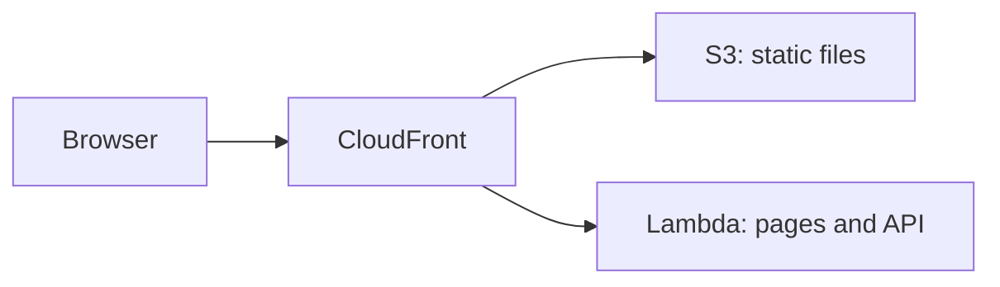

# AWS Lambda

<Badge label="Beta" color="orange" icon="rocket" />

يشغّل AWS Lambda خادم تطبيقك عند الطلب، لذلك لا يوجد خادم تحتاج إلى إعداده أو
إبقائه قيد التشغيل. لكن دالة Lambda لا تقدّم الملفات الثابتة للتطبيق، لذلك يستخدم
هذا الدليل ثلاث خدمات من AWS معًا:

- يشغّل **AWS Lambda** خادم التطبيق، الذي يتولى صفحاته وواجهته البرمجية.
- يخزّن **Amazon S3** الملفات الثابتة للتطبيق، مثل JavaScript وCSS والصور.
- يمنح **Amazon CloudFront** التطبيق عنوانًا عامًا واحدًا مع HTTPS ويرسل كل طلب
  إلى المكان الصحيح.



يشرح هذا الدليل نشر تطبيق مستقل واحد من البداية. ستنشئ التطبيق، وتمنحه قاعدة
بيانات إنتاجية وسر مصادقة، وتجهّز قاعدة البيانات، وتبنيه لـ Lambda، وتنشئ الدالة،
وترفع الملفات الثابتة، ثم تضع CloudFront أمامهما معًا.

<Callout tone="info">

يلزم Node.js `22.22+`.

</Callout>

تحتاج أيضًا إلى حساب AWS وإلى تثبيت [AWS CLI](https://docs.aws.amazon.com/cli/latest/userguide/getting-started-install.html)
على حاسوبك وتسجيل الدخول إليه، مع ضبط منطقة افتراضية. شغّل الأوامر في هذا الدليل
على حاسوبك الخاص. تستخدم الخطوتان 5 و6 أداة AWS CLI، وتستخدم الخطوة 7 وحدة تحكم
CloudFront.

## الخطوة 1: إنشاء التطبيق {#step-1-create-the-app}

أنشئ تطبيقك المستقل الجديد. ينشئ المثال أدناه تطبيقًا من قالب Chat، لكن يمكنك
البدء من أي قالب. انتقل إلى مجلد التطبيق وثبّت تبعياته. يفعّل الأمر
`corepack enable` إصدار `pnpm` الذي يتوقعه التطبيق، لذلك لا تحتاج إلى تثبيت
`pnpm` بنفسك.

```bash
npx --yes @agent-native/core@latest create my-app --standalone --template chat

cd my-app

corepack enable

pnpm install
```

استبدل `my-app` باسم تطبيقك إذا أردت. يفترض باقي هذا الدليل أنك داخل مجلد
التطبيق.

<Callout tone="info">

إذا فشلت هذه الأوامر بأخطاء في التبعيات النظيرة، فقد يكون السبب نسخة قديمة من حزمة في ذاكرة npx المؤقتة. شغّل `npx clear-npx-cache` لمسح الذاكرة المؤقتة، ثم شغّل الأوامر مرة أخرى.

</Callout>

## الخطوة 2: ضبط أسرار البيئة {#step-2-configure-environment-secrets}

يقرأ التطبيق إعدادات الإنتاج من متغيرات البيئة:

| المتغير              | مطلوب | الغرض                                                   |
| -------------------- | ----- | ------------------------------------------------------- |
| `DATABASE_URL`       | نعم   | يربط التطبيق بقاعدة بيانات PostgreSQL الخاصة به         |
| `BETTER_AUTH_SECRET` | نعم   | يوقّع جلسات المستخدمين                                  |
| `BETTER_AUTH_URL`    | نعم   | يحدد العنوان العام الذي يستخدمه الناس للوصول إلى تطبيقك |

تجعل أوامر التصدير أدناه الأوامر التالية تعمل في هذه الصدفة. قبل النشر، احفظ
المتغيرات نفسها في إعدادات بيئة المشروع أو الخدمة لدى موفر الاستضافة. تحفظ الخطوة
5 أول متغيرين على دالة Lambda، وتضيف الخطوة 8 المتغير `BETTER_AUTH_URL`.

### عنوان URL لقاعدة البيانات {#database-url}

أثناء التطوير المحلي، يخزّن التطبيق البيانات في قاعدة بيانات محلية عندما يكون
`DATABASE_URL` غير مضبوط. يحتاج التطبيق المنشور إلى قاعدة بيانات PostgreSQL
حقيقية تحتفظ ببياناتها بين عمليات النشر. لا يحتفظ Lambda بالملفات بين الطلبات،
لذلك يجب أن توجد قاعدة البيانات خارج الدالة. انسخ سلسلة الاتصال من موفر قاعدة
البيانات وصدّرها:

```bash
export DATABASE_URL='your-postgres-url-string'
```

توضح [أدلة موفري قواعد البيانات](/docs/neon) مكان العثور على سلسلة الاتصال لدى
كل موفر، بما في ذلك [Amazon RDS for PostgreSQL](/docs/aws-rds).

<Callout tone="warning">

اختر موفر PostgreSQL دائمًا: Neon أو Supabase أو Amazon RDS أو غيرها.

</Callout>

### سر المصادقة {#auth-secret}

أنشئ هذه القيمة مرة واحدة وأبقها ثابتة عبر عمليات النشر.

يستخدم التطبيق `BETTER_AUTH_SECRET` لتوقيع جلسات المستخدمين. إذا تغيّرت القيمة،
يُسجَّل خروج كل مستخدم مسجّل الدخول. ينشئ الأمر أدناه قيمة عشوائية:

```bash
export BETTER_AUTH_SECRET="$(openssl rand -hex 32)"
```

احفظ القيمة المُنشأة في مكان آمن، مثل مدير كلمات المرور. استخدم القيمة نفسها في
كل مرة تنشر فيها.

### عنوان URL العام {#public-url}

`BETTER_AUTH_URL` هو العنوان العام الذي يستخدمه الناس للوصول إلى تطبيقك. وهو
اختياري لدى معظم موفري الاستضافة، لأن التطبيق يستنتج عنوانه من كل طلب وارد. لكن
خلف CloudFront، تتلقى الدالة طلبات موجهة إلى عنوان Lambda URL الخاص بها بدلًا من
عنوانك العام، لذلك يحتاج التطبيق إلى هذا المتغير لبناء روابط تسجيل دخول وعمليات
إعادة توجيه OAuth صحيحة.

تحصل على العنوان عندما تنشئ توزيع CloudFront في الخطوة 7، وتضبط هذا المتغير في
الخطوة 8.

## الخطوة 3: الترحيل {#step-3-migrate}

تنشئ عمليات الترحيل الجداول التي يحتاجها التطبيق في قاعدة البيانات وتحدّثها.
شغّل هذا الأمر قبل أول عملية نشر:

```bash
pnpm migrate:production
```

يعمل الأمر على حاسوبك ويتصل بقاعدة بيانات الإنتاج باستخدام `DATABASE_URL` الذي
صدّرته في الخطوة 2. شغّله مرة أخرى بعد ترقية التطبيق، وقبل نشر الإصدار الجديد.

## الخطوة 4: البناء {#step-4-build}

ابنِ التطبيق لـ Lambda:

```bash
env -u DATABASE_URL -u BETTER_AUTH_SECRET -u BETTER_AUTH_URL NITRO_PRESET=aws-lambda pnpm build
```

يبني `NITRO_PRESET=aws-lambda` التطبيق بصفته دالة Lambda. يقسّم البناء المخرجات
إلى مجلدين:

<FileTree
  id="aws-lambda-build-output"
  entries={[
    {
      path: ".output/server/server.js",
      note: "ملف الدخول الخاص بالدالة. معالجه هو server.handler.",
    },
    {
      path: ".output/server/index.mjs",
      note: "شيفرة خادم التطبيق، ويحمّلها server.js.",
    },
    {
      path: ".output/server/.env",
      note: "متغيرات منسوخة من الصدفة عند البناء.",
    },
    {
      path: ".output/public/assets/",
      note: "ملفات JavaScript وCSS الخاصة بالتطبيق.",
    },
    {
      path: ".output/public/manifest.json",
      note: "الملفات الثابتة في المستوى الأعلى، مثل الأيقونات وبيان الويب.",
    },
  ]}
/>

يصبح المجلد `.output/server` دالة Lambda، ويذهب المجلد `.output/public` إلى S3.

<Callout tone="warning">

ينسخ البناء متغيرات التطبيق من الصدفة إلى `.output/server/.env`، الذي ينتهي به
المطاف داخل حزمة نشر الدالة. يزيل `env -u` الأسرار من بيئة البناء، فتبقى خارج
الحزمة. اضبطها على الدالة بدلًا من ذلك، كما توضح الخطوة 5 والخطوة 8.

</Callout>

## الخطوة 5: إنشاء الدالة {#step-5-create-the-function}

### إنشاء دور الدالة {#create-the-functions-role}

تحتاج الدالة إلى دور IAM يسمح لها بالعمل وكتابة السجلات. أنشئ دورًا واحدًا مرة
واحدة للتطبيق:

```bash
aws iam create-role --role-name my-app-lambda --assume-role-policy-document '{"Version":"2012-10-17","Statement":[{"Effect":"Allow","Principal":{"Service":"lambda.amazonaws.com"},"Action":"sts:AssumeRole"}]}'

aws iam attach-role-policy --role-name my-app-lambda --policy-arn arn:aws:iam::aws:policy/service-role/AWSLambdaBasicExecutionRole

export ROLE_ARN="$(aws iam get-role --role-name my-app-lambda --query Role.Arn --output text)"
```

### تحزيم الدالة وإنشاؤها {#package-and-create-the-function}

اضغط مجلد الخادم في ملف zip، ثم أنشئ الدالة من ملف zip:

```bash
(cd .output/server && zip -qr ../../function.zip .)

aws lambda create-function \
  --function-name my-app \
  --runtime nodejs24.x \
  --handler server.handler \
  --role "$ROLE_ARN" \
  --zip-file fileb://function.zip \
  --memory-size 1024 \
  --timeout 60 \
  --environment "$(node -e 'console.log(JSON.stringify({ Variables: { DATABASE_URL: process.env.DATABASE_URL, BETTER_AUTH_SECRET: process.env.BETTER_AUTH_SECRET } }))')"
```

يوجّه `--handler server.handler` منصة Lambda إلى ملف الدخول من الخطوة 4. يحوّل
الأمر `node -e` السرّين اللذين صدّرتهما في الخطوة 2 إلى الصيغة التي تتوقعها أداة
AWS CLI، لذلك لا تحتاج إلى لصقهما يدويًا. يمنح `--timeout 60` كل طلب ما يصل إلى
60 ثانية، وهو ما يطابق حد CloudFront في الخطوة 7.

قد يستغرق الدور الجديد بضع ثوانٍ حتى يصبح قابلًا للاستخدام. إذا أبلغ
`create-function` بأنه لا يمكن تولي الدور، فانتظر لحظة وشغّله مرة أخرى.

### إضافة عنوان URL للدالة {#add-a-function-url}

يمنح عنوان URL للدالة الدالةَ عنوان HTTPS خاصًا بها، ويستخدمه CloudFront في الخطوة
7:

```bash
aws lambda create-function-url-config --function-name my-app --auth-type NONE

aws lambda add-permission --function-name my-app --statement-id FunctionUrlPublic --action lambda:InvokeFunctionUrl --principal "*" --function-url-auth-type NONE

aws lambda add-permission --function-name my-app --statement-id FunctionUrlInvoke --action lambda:InvokeFunction --principal "*" --invoked-via-function-url
```

يطبع الأمر الأول قيمة `FunctionUrl`، التي تبدو مثل
`https://abc123.lambda-url.us-east-1.on.aws/`. انسخها لاستخدامها في الخطوة 7. يسمح
الأمران `add-permission` للطلبات بالوصول إلى الدالة عبر ذلك العنوان.

## الخطوة 6: رفع الملفات الثابتة {#step-6-upload-the-static-files}

أنشئ حاوية S3 للملفات الثابتة للتطبيق وانسخها إليها. أسماء الحاويات مشتركة في AWS
كلها، لذلك أضف شيئًا فريدًا إلى الاسم:

```bash
aws s3 mb s3://my-app-assets-123456

aws s3 sync .output/public s3://my-app-assets-123456
```

تبقى الحاوية خاصة. يقرأ CloudFront منها في الخطوة 7.

## الخطوة 7: وضع CloudFront في المقدمة {#step-7-put-cloudfront-in-front}

أنشئ توزيع CloudFront في
[وحدة تحكم CloudFront](https://console.aws.amazon.com/cloudfront/v4/home):

<Steps>

### إنشاء التوزيع

أنشئ توزيعًا واختر حاوية S3 من الخطوة 6 أصلًا له. في **Origin access**، اختر
**Origin access control settings (recommended)** وأنشئ إعداد تحكم جديدًا. بعد
إنشاء التوزيع، انسخ سياسة الحاوية التي تعرضها وحدة التحكم وأضفها إلى أذونات
الحاوية في وحدة تحكم S3، حتى يتمكن CloudFront من قراءة الملفات.

### إضافة الدالة أصلًا ثانيًا

في علامة التبويب **Origins** الخاصة بالتوزيع، أنشئ أصلًا. في **Origin domain**،
الصق اسم المضيف من عنوان URL للدالة من الخطوة 5، بدون `https://` أو الشرطة المائلة
في النهاية. اضبط **Protocol** على **HTTPS only** و**Response timeout** على 60
ثانية. لا تضف تحكمًا في الوصول إلى الأصل لهذا الأصل.

### إرسال طلبات التطبيق إلى الدالة

في علامة التبويب **Behaviors**، عدّل السلوك **Default (\*)**. اضبط أصله على
الدالة، و**Viewer protocol policy** على **Redirect HTTP to HTTPS**، و**Allowed
HTTP methods** على الخيار الذي يتضمن `POST`. اضبط **Cache policy** على
**CachingDisabled** و**Origin request policy** على **AllViewerExceptHostHeader**.

### إرسال الملفات الثابتة إلى S3

أنشئ سلوكًا بنمط المسار `/assets/*` وأصل S3، مستخدمًا سياسة التخزين المؤقت
**CachingOptimized**. أضف النوع نفسه من السلوك لكل ملف في المستوى الأعلى من
`.output/public`، مثل `*.svg` و`/manifest.json` لقالب Chat.

### نسخ العنوان

انتظر حتى ينتهي نشر التوزيع، ثم انسخ اسم نطاقه، الذي يبدو مثل
`d111111abcdef8.cloudfront.net`.

</Steps>

تمرّر **AllViewerExceptHostHeader** ملفات تعريف الارتباط والترويسات وسلاسل
الاستعلام من المتصفح إلى الدالة، لكن ليس ترويسة `Host` الخاصة به. لا يقبل عنوان
URL للدالة إلا الطلبات الموجهة إلى اسم المضيف الخاص به، ولهذا يحتاج التطبيق إلى
`BETTER_AUTH_URL` في الخطوة التالية.

## الخطوة 8: ضبط العنوان العام والنشر {#step-8-set-the-public-address-and-deploy}

صدّر عنوان CloudFront واحفظ المتغيرات الثلاثة كلها على الدالة:

```bash
export BETTER_AUTH_URL='https://d111111abcdef8.cloudfront.net'

aws lambda update-function-configuration \
  --function-name my-app \
  --environment "$(node -e 'console.log(JSON.stringify({ Variables: { DATABASE_URL: process.env.DATABASE_URL, BETTER_AUTH_SECRET: process.env.BETTER_AUTH_SECRET, BETTER_AUTH_URL: process.env.BETTER_AUTH_URL } }))')"
```

يستبدل هذا الأمر كل متغيرات الدالة دفعة واحدة، لذلك يتضمن أيضًا المتغيرين من
الخطوة 5. استخدم القائمة الكاملة نفسها كلما غيّرت متغيرًا.

افتح عنوان CloudFront وأنشئ الحساب الأول.

## نشر التحديثات {#deploy-updates}

لإصدار نسخة جديدة، شغّل عمليات الترحيل، وابنِ التطبيق مرة أخرى، وارفع شيفرة
الدالة الجديدة والملفات الثابتة، ثم امسح ذاكرة التخزين المؤقت لـ CloudFront:

```bash
pnpm migrate:production

env -u DATABASE_URL -u BETTER_AUTH_SECRET -u BETTER_AUTH_URL NITRO_PRESET=aws-lambda pnpm build

rm -f function.zip && (cd .output/server && zip -qr ../../function.zip .)

aws lambda update-function-code --function-name my-app --zip-file fileb://function.zip

aws s3 sync .output/public s3://my-app-assets-123456

aws cloudfront create-invalidation --distribution-id your-distribution-id --paths "/*"
```

يُبقي `aws s3 sync` ملفات الإصدار السابق في الحاوية، لذلك تظل الصفحات المفتوحة
بالفعل في المتصفح قادرة على تحميلها. تجد معرّف التوزيع في صفحة التوزيع في وحدة
تحكم CloudFront. تبقى متغيرات الدالة في مكانها، لذلك لا تحتاج إلى تكرار الخطوة 8.

## الحدود {#limits}

<Accordion>

### لماذا يكون عنوان URL للدالة عامًا؟

يستطيع CloudFront توقيع الطلبات إلى عنوان URL للدالة باستخدام التحكم في الوصول إلى
الأصل، لكن Lambda يشترط حينها أن يتضمن كل طلب `POST` و`PUT` تجزئة لمحتواه في
الترويسة `x-amz-content-sha256`. لا ترسل المتصفحات تلك الترويسة، لذلك ستفشل نماذج
التطبيق وإجراءاته. يبقى عنوان URL للدالة عامًا، ويكون CloudFront هو العنوان الذي
تشاركه.

### إلى متى يمكن أن يستمر الطلب؟

ينتظر CloudFront الدالة لمدة تصل إلى 60 ثانية، ومهلة الدالة هي أيضًا 60 ثانية.
ينهي Agent-Native بالفعل دورة المحادثة بعد نحو 40 ثانية ويواصلها من المتصفح، لذلك
تكتمل دورات الوكيل الطويلة، لكنها تعمل على عدة خطوات بدلًا من خطوة واحدة.

### هل تُبث الاستجابات تدفقيًا؟

لا. تعيد الدالة كل استجابة دفعة واحدة، ويمكن أن يبلغ حجم الاستجابة الواحدة 6 MB
على الأكثر.

### ما الحجم الذي يمكن أن يبلغه التطبيق؟

يمكن أن يبلغ حجم ملف zip المرفوع مباشرة إلى Lambda 50 MB على الأكثر، ويمكن أن
يبلغ حجم الدالة بعد فك ضغطها 250 MB على الأكثر. إذا كان `function.zip` أكبر من
50 MB، فارفعه إلى S3 أولًا وأنشئ الدالة أو حدّثها من هناك.

</Accordion>

## ما هي الخطوة التالية {#whats-next}

- [**Node.js**](/docs/node-js) - شغّل التطبيق على جهاز تديره بنفسك
- [**متغيرات بيئة النشر**](/docs/deployment-environment-variables) - القائمة الكاملة لإعدادات الإنتاج
- [**النشر**](/docs/deployment) - قارن بين أهداف الاستضافة ومتطلباتها الأساسية
