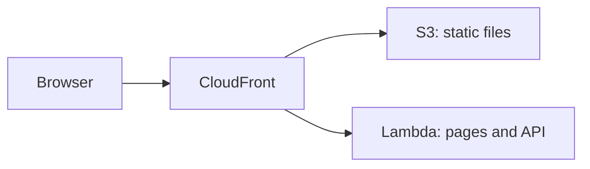

# AWS Lambda

<Badge label="Beta" color="orange" icon="rocket" />

AWS Lambda führt den Server Ihrer App bei Bedarf aus. Sie müssen also keinen
Server einrichten oder am Laufen halten. Eine Lambda-Funktion liefert die
statischen Dateien der App allerdings nicht aus. Diese Anleitung verwendet
deshalb drei AWS-Dienste zusammen:

- **AWS Lambda** führt den Server der App aus, der ihre Seiten und ihre API
  bereitstellt.
- **Amazon S3** speichert die statischen Dateien der App, zum Beispiel
  JavaScript, CSS und Bilder.
- **Amazon CloudFront** gibt der App eine einzige öffentliche Adresse mit HTTPS
  und leitet jede Anfrage an die richtige Stelle weiter.



Diese Anleitung führt Sie Schritt für Schritt durch das Deployment einer
eigenständigen App. Sie erstellen die App, geben ihr eine Produktionsdatenbank
und ein Auth-Secret, bereiten die Datenbank vor, bauen sie für Lambda, erstellen
die Funktion, laden die statischen Dateien hoch und schalten dann CloudFront vor
beide.

<Callout tone="info">

Node.js `22.22+` ist erforderlich.

</Callout>

Außerdem brauchen Sie ein AWS-Konto und die
[AWS CLI](https://docs.aws.amazon.com/cli/latest/userguide/getting-started-install.html),
installiert und angemeldet auf Ihrem Computer, mit einer festgelegten
Standardregion. Führen Sie die Befehle dieser Anleitung auf Ihrem eigenen
Computer aus. Schritt 5 und 6 verwenden die AWS CLI, und Schritt 7 verwendet die
CloudFront-Konsole.

## Schritt 1: Die App erstellen {#step-1-create-the-app}

Erstellen Sie Ihre neue eigenständige App. Das folgende Beispiel erstellt eine
App aus dem Chat-Template, Sie können aber mit jedem Template beginnen. Wechseln
Sie in den Ordner der App und installieren Sie ihre Abhängigkeiten.
`corepack enable` aktiviert die `pnpm`-Version, die die App erwartet. Sie müssen
`pnpm` also nicht selbst installieren.

```bash
npx --yes @agent-native/core@latest create my-app --standalone --template chat

cd my-app

corepack enable

pnpm install
```

Ersetzen Sie `my-app` bei Bedarf durch Ihren eigenen App-Namen. Der Rest dieser
Anleitung geht davon aus, dass Sie sich im Ordner der App befinden.

<Callout tone="info">

Wenn diese Befehle mit Fehlern zu Peer-Abhängigkeiten fehlschlagen, liegt das möglicherweise an einer veralteten Kopie eines Pakets in Ihrem npx-Cache. Führen Sie `npx clear-npx-cache` aus, um den Cache zu leeren, und führen Sie die Befehle dann erneut aus.

</Callout>

## Schritt 2: Umgebungs-Secrets konfigurieren {#step-2-configure-environment-secrets}

Die App liest ihre Produktionseinstellungen aus Umgebungsvariablen:

| Variable             | Erforderlich | Zweck                                                               |
| -------------------- | ------------ | ------------------------------------------------------------------- |
| `DATABASE_URL`       | Ja           | Verbindet die App mit ihrer PostgreSQL-Datenbank                    |
| `BETTER_AUTH_SECRET` | Ja           | Signiert Benutzersitzungen                                          |
| `BETTER_AUTH_URL`    | Ja           | Legt die öffentliche Adresse fest, über die Ihre App erreichbar ist |

Mit den folgenden Exporten funktionieren die nächsten Befehle in dieser Shell.
Speichern Sie vor dem Deployment dieselben Variablen in den Umgebungseinstellungen
des Projekts oder Dienstes bei Ihrem Hoster. Schritt 5 speichert die ersten
beiden in der Lambda-Funktion, und Schritt 8 fügt `BETTER_AUTH_URL` hinzu.

### Datenbank-URL {#database-url}

Während der lokalen Entwicklung speichert die App ihre Daten in einer lokalen
Datenbank, wenn `DATABASE_URL` nicht gesetzt ist. Eine bereitgestellte App
braucht eine echte PostgreSQL-Datenbank, die ihre Daten über Deployments hinweg
behält. Lambda behält keine Dateien zwischen Anfragen. Die Datenbank muss sich
daher außerhalb der Funktion befinden. Kopieren Sie den Verbindungsstring von
Ihrem Anbieter und exportieren Sie ihn:

```bash
export DATABASE_URL='your-postgres-url-string'
```

Die [Anleitungen zu Datenbankanbietern](/docs/neon) zeigen, wo Sie den
Verbindungsstring für jeden Anbieter finden, auch für
[Amazon RDS for PostgreSQL](/docs/aws-rds).

<Callout tone="warning">

Wählen Sie einen persistenten PostgreSQL-Anbieter, zum Beispiel Neon, Supabase oder Amazon RDS.

</Callout>

### Auth-Secret {#auth-secret}

Erzeugen Sie diesen Wert einmal und lassen Sie ihn über alle Deployments hinweg
unverändert.

Die App verwendet `BETTER_AUTH_SECRET`, um Benutzersitzungen zu signieren. Wenn
sich der Wert ändert, werden alle angemeldeten Benutzer abgemeldet. Der folgende
Befehl erzeugt einen zufälligen Wert:

```bash
export BETTER_AUTH_SECRET="$(openssl rand -hex 32)"
```

Bewahren Sie den erzeugten Wert an einem sicheren Ort auf, zum Beispiel in einem
Passwort-Manager. Verwenden Sie bei jedem Deployment denselben Wert.

### Öffentliche URL {#public-url}

`BETTER_AUTH_URL` ist die öffentliche Adresse, über die Ihre App erreichbar ist.
Bei den meisten Hostern ist die Variable optional, weil die App ihre Adresse aus
jeder eingehenden Anfrage ermittelt. Hinter CloudFront erhält die Funktion
Anfragen, die an ihre eigene Lambda-URL statt an Ihre öffentliche Adresse
gerichtet sind. Die App braucht diese Variable daher, um korrekte Anmeldelinks
und OAuth-Weiterleitungen zu erzeugen.

Sie erhalten die Adresse, wenn Sie in Schritt 7 die CloudFront-Distribution
erstellen, und Sie setzen diese Variable in Schritt 8.

## Schritt 3: Migrieren {#step-3-migrate}

Migrationen erstellen und aktualisieren die Tabellen, die die App in Ihrer
Datenbank braucht. Führen Sie dies vor dem ersten Deployment aus:

```bash
pnpm migrate:production
```

Der Befehl läuft auf Ihrem Computer und verbindet sich über die
`DATABASE_URL`, die Sie in Schritt 2 exportiert haben, mit der
Produktionsdatenbank. Führen Sie ihn nach einem Upgrade der App erneut aus,
bevor Sie die neue Version deployen.

## Schritt 4: Bauen {#step-4-build}

Bauen Sie die App für Lambda:

```bash
env -u DATABASE_URL -u BETTER_AUTH_SECRET -u BETTER_AUTH_URL NITRO_PRESET=aws-lambda pnpm build
```

`NITRO_PRESET=aws-lambda` baut die App als Lambda-Funktion. Der Build teilt die
Ausgabe auf zwei Ordner auf:

<FileTree
  id="aws-lambda-build-output"
  entries={[
    {
      path: ".output/server/server.js",
      note: "Die Einstiegsdatei der Funktion. Ihr Handler ist server.handler.",
    },
    {
      path: ".output/server/index.mjs",
      note: "Der Servercode der App, den server.js lädt.",
    },
    {
      path: ".output/server/.env",
      note: "Variablen, die beim Build aus Ihrer Shell kopiert werden.",
    },
    {
      path: ".output/public/assets/",
      note: "Die JavaScript- und CSS-Dateien der App.",
    },
    {
      path: ".output/public/manifest.json",
      note: "Statische Dateien der obersten Ebene, zum Beispiel Icons und das Web-Manifest.",
    },
  ]}
/>

Der Ordner `.output/server` wird zur Lambda-Funktion, und der Ordner
`.output/public` kommt nach S3.

<Callout tone="warning">

Der Build kopiert die Variablen der App aus Ihrer Shell nach
`.output/server/.env`. Diese Datei landet im Deployment-Paket der Funktion.
`env -u` entfernt die Secrets aus der Umgebung des Builds, damit sie nicht in
das Paket gelangen. Setzen Sie sie stattdessen in der Funktion, wie Schritt 5
und Schritt 8 zeigen.

</Callout>

## Schritt 5: Die Funktion erstellen {#step-5-create-the-function}

### Die Rolle der Funktion erstellen {#create-the-functions-role}

Die Funktion braucht eine IAM-Rolle, mit der sie laufen und Logs schreiben darf.
Erstellen Sie diese Rolle einmal für die App:

```bash
aws iam create-role --role-name my-app-lambda --assume-role-policy-document '{"Version":"2012-10-17","Statement":[{"Effect":"Allow","Principal":{"Service":"lambda.amazonaws.com"},"Action":"sts:AssumeRole"}]}'

aws iam attach-role-policy --role-name my-app-lambda --policy-arn arn:aws:iam::aws:policy/service-role/AWSLambdaBasicExecutionRole

export ROLE_ARN="$(aws iam get-role --role-name my-app-lambda --query Role.Arn --output text)"
```

### Die Funktion verpacken und erstellen {#package-and-create-the-function}

Packen Sie den Server-Ordner in eine ZIP-Datei und erstellen Sie die Funktion
dann aus dieser Datei:

```bash
(cd .output/server && zip -qr ../../function.zip .)

aws lambda create-function \
  --function-name my-app \
  --runtime nodejs24.x \
  --handler server.handler \
  --role "$ROLE_ARN" \
  --zip-file fileb://function.zip \
  --memory-size 1024 \
  --timeout 60 \
  --environment "$(node -e 'console.log(JSON.stringify({ Variables: { DATABASE_URL: process.env.DATABASE_URL, BETTER_AUTH_SECRET: process.env.BETTER_AUTH_SECRET } }))')"
```

`--handler server.handler` verweist Lambda auf die Einstiegsdatei aus
Schritt 4. Der Befehl `node -e` wandelt die beiden Secrets, die Sie in Schritt 2
exportiert haben, in das Format um, das die AWS CLI erwartet. Sie müssen sie
also nicht von Hand einfügen. `--timeout 60` gibt jeder Anfrage bis zu
60 Sekunden Zeit. Das entspricht dem CloudFront-Limit in Schritt 7.

Eine neue Rolle kann einige Sekunden brauchen, bis sie nutzbar ist. Wenn
`create-function` meldet, dass die Rolle nicht übernommen werden kann, warten
Sie einen Moment und führen Sie den Befehl erneut aus.

### Eine Funktions-URL hinzufügen {#add-a-function-url}

Eine Funktions-URL gibt der Funktion ihre eigene HTTPS-Adresse, die CloudFront
in Schritt 7 verwendet:

```bash
aws lambda create-function-url-config --function-name my-app --auth-type NONE

aws lambda add-permission --function-name my-app --statement-id FunctionUrlPublic --action lambda:InvokeFunctionUrl --principal "*" --function-url-auth-type NONE

aws lambda add-permission --function-name my-app --statement-id FunctionUrlInvoke --action lambda:InvokeFunction --principal "*" --invoked-via-function-url
```

Der erste Befehl gibt die `FunctionUrl` aus, die etwa so aussieht:
`https://abc123.lambda-url.us-east-1.on.aws/`. Kopieren Sie sie für Schritt 7.
Die beiden Befehle `add-permission` erlauben, dass Anfragen die Funktion über
diese Adresse erreichen.

## Schritt 6: Die statischen Dateien hochladen {#step-6-upload-the-static-files}

Erstellen Sie einen S3-Bucket für die statischen Dateien der App und kopieren
Sie sie hinein. Bucket-Namen gelten für ganz AWS. Ergänzen Sie den Namen daher
um etwas Eindeutiges:

```bash
aws s3 mb s3://my-app-assets-123456

aws s3 sync .output/public s3://my-app-assets-123456
```

Der Bucket bleibt privat. CloudFront liest in Schritt 7 daraus.

## Schritt 7: CloudFront davorschalten {#step-7-put-cloudfront-in-front}

Erstellen Sie die CloudFront-Distribution in der
[CloudFront-Konsole](https://console.aws.amazon.com/cloudfront/v4/home):

<Steps>

### Die Distribution erstellen

Erstellen Sie eine Distribution und wählen Sie den S3-Bucket aus Schritt 6 als
ihren Origin. Wählen Sie für **Origin access** die Option
**Origin access control settings (recommended)** und erstellen Sie eine neue
Control-Einstellung. Kopieren Sie nach dem Erstellen der Distribution die
Bucket-Richtlinie, die die Konsole anbietet, und fügen Sie sie in der S3-Konsole
zu den Berechtigungen des Buckets hinzu, damit CloudFront die Dateien lesen
kann.

### Die Funktion als zweiten Origin hinzufügen

Erstellen Sie auf dem Tab **Origins** der Distribution einen Origin. Fügen Sie
bei **Origin domain** den Hostnamen der Funktions-URL aus Schritt 5 ein, ohne
`https://` und ohne den abschließenden Schrägstrich. Setzen Sie **Protocol** auf
**HTTPS only** und **Response timeout** auf 60 Sekunden. Fügen Sie diesem Origin
keine Origin Access Control hinzu.

### App-Anfragen an die Funktion senden

Bearbeiten Sie auf dem Tab **Behaviors** das Behavior **Default (\*)**. Setzen
Sie seinen Origin auf die Funktion, **Viewer protocol policy** auf
**Redirect HTTP to HTTPS** und **Allowed HTTP methods** auf die Option, die
`POST` enthält. Setzen Sie **Cache policy** auf **CachingDisabled** und
**Origin request policy** auf **AllViewerExceptHostHeader**.

### Statische Dateien an S3 senden

Erstellen Sie ein Behavior mit dem Pfadmuster `/assets/*` und dem S3-Origin, mit
der Cache Policy **CachingOptimized**. Fügen Sie dieselbe Art von Behavior für
jede Datei der obersten Ebene in `.output/public` hinzu, zum Beispiel `*.svg`
und `/manifest.json` beim Chat-Template.

### Die Adresse kopieren

Warten Sie, bis das Deployment der Distribution abgeschlossen ist, und kopieren
Sie dann ihren Domainnamen, der etwa so aussieht:
`d111111abcdef8.cloudfront.net`.

</Steps>

**AllViewerExceptHostHeader** leitet die Cookies, Header und Query-Strings des
Browsers an die Funktion weiter, aber nicht seinen `Host`-Header. Die
Funktions-URL akzeptiert nur Anfragen, die an ihren eigenen Hostnamen gerichtet
sind. Deshalb braucht die App im nächsten Schritt `BETTER_AUTH_URL`.

## Schritt 8: Die öffentliche Adresse setzen und bereitstellen {#step-8-set-the-public-address-and-deploy}

Exportieren Sie die CloudFront-Adresse und speichern Sie alle drei Variablen in
der Funktion:

```bash
export BETTER_AUTH_URL='https://d111111abcdef8.cloudfront.net'

aws lambda update-function-configuration \
  --function-name my-app \
  --environment "$(node -e 'console.log(JSON.stringify({ Variables: { DATABASE_URL: process.env.DATABASE_URL, BETTER_AUTH_SECRET: process.env.BETTER_AUTH_SECRET, BETTER_AUTH_URL: process.env.BETTER_AUTH_URL } }))')"
```

Dieser Befehl ersetzt alle Variablen der Funktion auf einmal. Er enthält daher
auch die beiden aus Schritt 5. Verwenden Sie dieselbe vollständige Liste, wenn
Sie eine Variable ändern.

Öffnen Sie die CloudFront-Adresse und erstellen Sie das erste Konto.

## Updates bereitstellen {#deploy-updates}

Um eine neue Version auszuliefern, führen Sie die Migrationen aus, bauen Sie
erneut, laden Sie den neuen Funktionscode und die statischen Dateien hoch und
leeren Sie den Cache von CloudFront:

```bash
pnpm migrate:production

env -u DATABASE_URL -u BETTER_AUTH_SECRET -u BETTER_AUTH_URL NITRO_PRESET=aws-lambda pnpm build

rm -f function.zip && (cd .output/server && zip -qr ../../function.zip .)

aws lambda update-function-code --function-name my-app --zip-file fileb://function.zip

aws s3 sync .output/public s3://my-app-assets-123456

aws cloudfront create-invalidation --distribution-id your-distribution-id --paths "/*"
```

`aws s3 sync` behält die Dateien der vorherigen Version im Bucket. Seiten, die
bereits in einem Browser geöffnet sind, können sie also weiterhin laden. Die
Distribution-ID finden Sie auf der Seite der Distribution in der
CloudFront-Konsole. Die Variablen der Funktion bleiben erhalten. Sie müssen
Schritt 8 also nicht wiederholen.

## Limits {#limits}

<Accordion>

### Warum ist die Funktions-URL öffentlich?

CloudFront kann Anfragen an eine Funktions-URL mit Origin Access Control
signieren. Lambda verlangt dann aber, dass jede `POST`- und `PUT`-Anfrage einen
Hash ihres Bodys im Header `x-amz-content-sha256` enthält. Browser senden diesen
Header nicht, daher würden die Formulare und Aktionen der App fehlschlagen. Die
Funktions-URL bleibt öffentlich, und CloudFront ist die Adresse, die Sie
weitergeben.

### Wie lange kann eine Anfrage laufen?

CloudFront wartet bis zu 60 Sekunden auf die Funktion, und das Timeout der
Funktion beträgt ebenfalls 60 Sekunden. Agent-Native beendet einen
Chat-Durchgang bereits nach etwa 40 Sekunden und setzt ihn im Browser fort.
Lange Agent-Durchgänge werden also trotzdem fertig, laufen aber in mehreren
Schritten statt in einem.

### Werden Antworten gestreamt?

Nein. Die Funktion gibt jede Antwort in einem Stück zurück, und eine einzelne
Antwort darf höchstens 6 MB groß sein.

### Wie groß darf die App sein?

Eine direkt zu Lambda hochgeladene ZIP-Datei darf höchstens 50 MB groß sein, und
die entpackte Funktion höchstens 250 MB. Wenn `function.zip` größer als 50 MB
ist, laden Sie die Datei zuerst nach S3 hoch und erstellen oder aktualisieren
Sie die Funktion von dort.

</Accordion>

## Was kommt als nächstes? {#whats-next}

- [**Node.js**](/docs/node-js) - die App auf einer Maschine betreiben, die Sie selbst verwalten
- [**Umgebungsvariablen für das Deployment**](/docs/deployment-environment-variables) - die vollständige Liste der Produktionseinstellungen
- [**Deployment**](/docs/deployment) - Hosting-Ziele und Voraussetzungen vergleichen
