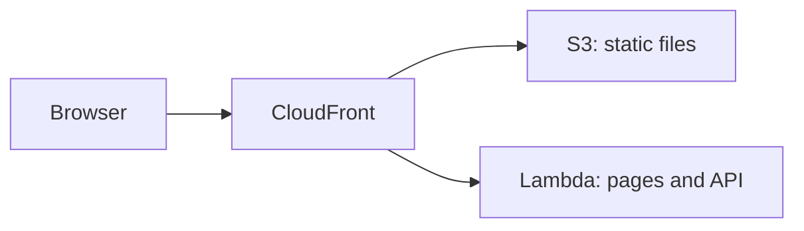

# AWS Lambda

<Badge label="Beta" color="orange" icon="rocket" />

AWS Lambda ejecuta el servidor de tu aplicación bajo demanda, así que no hay ningún servidor que configurar
ni mantener en ejecución. Sin embargo, una función de Lambda no sirve los archivos estáticos de la aplicación,
así que esta guía usa tres servicios de AWS juntos:

- **AWS Lambda** ejecuta el servidor de la aplicación, que gestiona sus páginas y su API.
- **Amazon S3** guarda los archivos estáticos de la aplicación, como JavaScript, CSS e
  imágenes.
- **Amazon CloudFront** le da a la aplicación una sola dirección pública con HTTPS y envía
  cada solicitud al lugar correcto.



Esta guía explica cómo implementar una aplicación independiente desde cero. Vas a
crear la aplicación, darle una base de datos de producción y un secreto de autenticación, preparar la
base de datos, compilarla para Lambda, crear la función, subir los archivos estáticos
y, después, poner CloudFront delante de ambos.

<Callout tone="info">

Se requiere Node.js `22.22+`.

</Callout>

También necesitas una cuenta de AWS y la [AWS CLI](https://docs.aws.amazon.com/cli/latest/userguide/getting-started-install.html)
instalada y con la sesión iniciada en tu equipo, con una región predeterminada definida. Ejecuta los
comandos de esta guía en tu propio equipo. Los pasos 5 y 6 usan la AWS CLI, y
el paso 7 usa la consola de CloudFront.

## Paso 1: Crea la aplicación {#step-1-create-the-app}

Crea tu nueva aplicación independiente. El siguiente ejemplo crea una aplicación a partir de la plantilla Chat,
pero puedes empezar desde cualquier plantilla. Entra en la carpeta de la aplicación e
instala sus dependencias. `corepack enable` activa la versión de `pnpm` que la aplicación
espera, así que no necesitas instalar `pnpm` por tu cuenta.

```bash
npx --yes @agent-native/core@latest create my-app --standalone --template chat

cd my-app

corepack enable

pnpm install
```

Si quieres, reemplaza `my-app` por el nombre de tu aplicación. El resto de esta guía
supone que estás dentro de la carpeta de la aplicación.

<Callout tone="info">

Si estos comandos fallan con errores de dependencias peer, la causa puede ser una copia desactualizada de un paquete en tu caché de npx. Ejecuta `npx clear-npx-cache` para vaciar la caché y vuelve a ejecutar los comandos.

</Callout>

## Paso 2: Configura los secretos del entorno {#step-2-configure-environment-secrets}

La aplicación lee su configuración de producción desde variables de entorno:

| Variable             | Obligatoria | Propósito                                                                      |
| -------------------- | ----------- | ------------------------------------------------------------------------------ |
| `DATABASE_URL`       | Sí          | Conecta la aplicación con su base de datos PostgreSQL                          |
| `BETTER_AUTH_SECRET` | Sí          | Firma las sesiones de los usuarios                                             |
| `BETTER_AUTH_URL`    | Sí          | Define la dirección pública que usan las personas para acceder a tu aplicación |

Las exportaciones siguientes hacen que los comandos posteriores funcionen en esta terminal. Antes de
implementar, guarda estas mismas variables en la configuración del entorno del proyecto o servicio de tu host.
El paso 5 guarda las dos primeras en la función de Lambda, y
el paso 8 añade `BETTER_AUTH_URL`.

### URL de la base de datos {#database-url}

Durante el desarrollo local, la aplicación guarda los datos en una base de datos local cuando
`DATABASE_URL` no está definida. Una aplicación implementada necesita una base de datos PostgreSQL real que
conserve sus datos entre implementaciones. Lambda no conserva archivos entre solicitudes, así que
la base de datos debe estar fuera de la función. Copia la cadena de conexión
de tu proveedor y expórtala:

```bash
export DATABASE_URL='your-postgres-url-string'
```

Las [guías de proveedores de bases de datos](/docs/neon) muestran dónde encontrar la cadena de conexión
de cada proveedor, incluido
[Amazon RDS for PostgreSQL](/docs/aws-rds).

<Callout tone="warning">

Elige un proveedor de PostgreSQL persistente, como Neon, Supabase o Amazon RDS.

</Callout>

### Secreto de autenticación {#auth-secret}

Genéralo una sola vez y mantenlo igual en todas las implementaciones.

La aplicación usa `BETTER_AUTH_SECRET` para firmar las sesiones de los usuarios. Si cambia, se cierra la sesión de
todos los usuarios que la tenían iniciada. El siguiente comando genera un valor aleatorio:

```bash
export BETTER_AUTH_SECRET="$(openssl rand -hex 32)"
```

Guarda el valor generado en un lugar seguro, como un gestor de contraseñas. Usa el
mismo valor cada vez que implementes.

### URL pública {#public-url}

`BETTER_AUTH_URL` es la dirección pública que usan las personas para acceder a tu aplicación. En la mayoría de los
hosts es opcional, porque la aplicación deduce su dirección a partir de cada solicitud
entrante. Detrás de CloudFront, la función recibe solicitudes dirigidas a su propia
URL de Lambda en lugar de a tu dirección pública, así que la aplicación necesita esta variable para
crear enlaces de inicio de sesión y redirecciones de OAuth correctos.

Obtienes la dirección cuando creas la distribución de CloudFront en el paso 7, y
defines esta variable en el paso 8.

## Paso 3: Ejecuta las migraciones {#step-3-migrate}

Las migraciones crean y actualizan las tablas que la aplicación necesita en tu base de datos. Ejecuta
esto antes de la primera implementación:

```bash
pnpm migrate:production
```

El comando se ejecuta en tu equipo y se conecta a la base de datos de producción con
la `DATABASE_URL` que exportaste en el paso 2. Vuelve a ejecutarlo después de actualizar la
aplicación y antes de implementar la nueva versión.

## Paso 4: Compila {#step-4-build}

Compila la aplicación para Lambda:

```bash
env -u DATABASE_URL -u BETTER_AUTH_SECRET -u BETTER_AUTH_URL NITRO_PRESET=aws-lambda pnpm build
```

`NITRO_PRESET=aws-lambda` compila la aplicación como una función de Lambda. La compilación divide
el resultado en dos carpetas:

<FileTree
  id="aws-lambda-build-output"
  entries={[
    {
      path: ".output/server/server.js",
      note: "El archivo de entrada de la función. Su handler es server.handler.",
    },
    {
      path: ".output/server/index.mjs",
      note: "El código del servidor de la aplicación, que carga server.js.",
    },
    {
      path: ".output/server/.env",
      note: "Variables copiadas desde tu terminal al compilar.",
    },
    {
      path: ".output/public/assets/",
      note: "Los archivos JavaScript y CSS de la aplicación.",
    },
    {
      path: ".output/public/manifest.json",
      note: "Archivos estáticos de nivel superior, como los iconos y el manifiesto web.",
    },
  ]}
/>

La carpeta `.output/server` se convierte en la función de Lambda, y la
carpeta `.output/public` va a S3.

<Callout tone="warning">

La compilación copia las variables de la aplicación desde tu terminal a
`.output/server/.env`, que termina dentro del paquete de implementación de la función.
`env -u` quita los secretos del entorno de la compilación, así que quedan fuera del
paquete. Defínelos en la función, como muestran el paso 5 y el paso 8.

</Callout>

## Paso 5: Crea la función {#step-5-create-the-function}

### Crea el rol de la función {#create-the-functions-role}

La función necesita un rol de IAM que le permita ejecutarse y escribir registros. Créalo una sola vez
para la aplicación:

```bash
aws iam create-role --role-name my-app-lambda --assume-role-policy-document '{"Version":"2012-10-17","Statement":[{"Effect":"Allow","Principal":{"Service":"lambda.amazonaws.com"},"Action":"sts:AssumeRole"}]}'

aws iam attach-role-policy --role-name my-app-lambda --policy-arn arn:aws:iam::aws:policy/service-role/AWSLambdaBasicExecutionRole

export ROLE_ARN="$(aws iam get-role --role-name my-app-lambda --query Role.Arn --output text)"
```

### Empaqueta y crea la función {#package-and-create-the-function}

Comprime la carpeta del servidor en un archivo zip y, después, crea la función a partir de ese archivo:

```bash
(cd .output/server && zip -qr ../../function.zip .)

aws lambda create-function \
  --function-name my-app \
  --runtime nodejs24.x \
  --handler server.handler \
  --role "$ROLE_ARN" \
  --zip-file fileb://function.zip \
  --memory-size 1024 \
  --timeout 60 \
  --environment "$(node -e 'console.log(JSON.stringify({ Variables: { DATABASE_URL: process.env.DATABASE_URL, BETTER_AUTH_SECRET: process.env.BETTER_AUTH_SECRET } }))')"
```

`--handler server.handler` indica a Lambda el archivo de entrada del paso 4. El
comando `node -e` convierte los dos secretos que exportaste en el paso 2 al formato
que espera la AWS CLI, así que no tienes que pegarlos a mano. `--timeout 60`
da a cada solicitud hasta 60 segundos, lo que coincide con el límite de CloudFront del
paso 7.

Un rol nuevo puede tardar unos segundos en estar disponible. Si `create-function`
indica que no se puede asumir el rol, espera un momento y vuelve a ejecutarlo.

### Añade una URL de función {#add-a-function-url}

Una URL de función le da a la función su propia dirección HTTPS, que CloudFront usa
en el paso 7:

```bash
aws lambda create-function-url-config --function-name my-app --auth-type NONE

aws lambda add-permission --function-name my-app --statement-id FunctionUrlPublic --action lambda:InvokeFunctionUrl --principal "*" --function-url-auth-type NONE

aws lambda add-permission --function-name my-app --statement-id FunctionUrlInvoke --action lambda:InvokeFunction --principal "*" --invoked-via-function-url
```

El primer comando muestra la `FunctionUrl`, que tiene un aspecto como
`https://abc123.lambda-url.us-east-1.on.aws/`. Cópiala para el paso 7. Los dos
comandos `add-permission` permiten que las solicitudes lleguen a la función a través de esa
dirección.

## Paso 6: Sube los archivos estáticos {#step-6-upload-the-static-files}

Crea un bucket de S3 para los archivos estáticos de la aplicación y cópialos en él. Los nombres de los buckets
se comparten en todo AWS, así que añade algo único al nombre:

```bash
aws s3 mb s3://my-app-assets-123456

aws s3 sync .output/public s3://my-app-assets-123456
```

El bucket sigue siendo privado. CloudFront lee de él en el paso 7.

## Paso 7: Pon CloudFront delante {#step-7-put-cloudfront-in-front}

Crea la distribución de CloudFront en la
[consola de CloudFront](https://console.aws.amazon.com/cloudfront/v4/home):

<Steps>

### Crea la distribución

Crea una distribución y elige el bucket de S3 del paso 6 como su origen. En
**Origin access**, elige **Origin access control settings (recommended)** y
crea una nueva configuración de control. Cuando se haya creado la distribución, copia la
política del bucket que ofrece la consola y añádela a los permisos del bucket en
la consola de S3, para que CloudFront pueda leer los archivos.

### Añade la función como segundo origen

En la pestaña **Origins** de la distribución, crea un origen. En **Origin domain**,
pega el nombre de host de la URL de la función del paso 5, sin `https://` ni la
barra final. Define **Protocol** como **HTTPS only** y **Response timeout** como
60 segundos. No añadas un control de acceso al origen a este origen.

### Envía las solicitudes de la aplicación a la función

En la pestaña **Behaviors**, edita el comportamiento **Default (\*)**. Define su origen como
la función, **Viewer protocol policy** como **Redirect HTTP to HTTPS** y
**Allowed HTTP methods** como la opción que incluye `POST`. Define **Cache
policy** como **CachingDisabled** y **Origin request policy** como
**AllViewerExceptHostHeader**.

### Envía los archivos estáticos a S3

Crea un comportamiento con el patrón de ruta `/assets/*` y el origen de S3, con
la política de caché **CachingOptimized**. Añade el mismo tipo de comportamiento para cada
archivo de nivel superior de `.output/public`, como `*.svg` y `/manifest.json` en
la plantilla Chat.

### Copia la dirección

Espera a que la distribución termine de implementarse y, después, copia su nombre de dominio, que
tiene un aspecto como `d111111abcdef8.cloudfront.net`.

</Steps>

**AllViewerExceptHostHeader** reenvía a la función las cookies, los encabezados y las
cadenas de consulta del navegador, pero no su encabezado `Host`. La URL de la función solo
acepta solicitudes dirigidas a su propio nombre de host, y por eso la aplicación necesita
`BETTER_AUTH_URL` en el siguiente paso.

## Paso 8: Define la dirección pública e implementa {#step-8-set-the-public-address-and-deploy}

Exporta la dirección de CloudFront y guarda las tres variables en la función:

```bash
export BETTER_AUTH_URL='https://d111111abcdef8.cloudfront.net'

aws lambda update-function-configuration \
  --function-name my-app \
  --environment "$(node -e 'console.log(JSON.stringify({ Variables: { DATABASE_URL: process.env.DATABASE_URL, BETTER_AUTH_SECRET: process.env.BETTER_AUTH_SECRET, BETTER_AUTH_URL: process.env.BETTER_AUTH_URL } }))')"
```

Este comando reemplaza todas las variables de la función a la vez, así que también incluye
las dos del paso 5. Usa la misma lista completa siempre que cambies una
variable.

Abre la dirección de CloudFront y crea la primera cuenta.

## Implementa actualizaciones {#deploy-updates}

Para publicar una nueva versión, ejecuta las migraciones, vuelve a compilar, sube el nuevo
código de la función y los archivos estáticos, y vacía la caché de CloudFront:

```bash
pnpm migrate:production

env -u DATABASE_URL -u BETTER_AUTH_SECRET -u BETTER_AUTH_URL NITRO_PRESET=aws-lambda pnpm build

rm -f function.zip && (cd .output/server && zip -qr ../../function.zip .)

aws lambda update-function-code --function-name my-app --zip-file fileb://function.zip

aws s3 sync .output/public s3://my-app-assets-123456

aws cloudfront create-invalidation --distribution-id your-distribution-id --paths "/*"
```

`aws s3 sync` conserva en el bucket los archivos de la versión anterior, para que las páginas que
ya están abiertas en un navegador puedan seguir cargándolos. Encuentra el ID de la distribución en
la página de la distribución en la consola de CloudFront. Las variables de la función
se mantienen, así que no necesitas repetir el paso 8.

## Límites {#limits}

<Accordion>

### ¿Por qué es pública la URL de la función?

CloudFront puede firmar las solicitudes a una URL de función con el control de acceso al origen, pero
en ese caso Lambda exige que cada solicitud `POST` y `PUT` incluya un hash de su
cuerpo en un encabezado `x-amz-content-sha256`. Los navegadores no envían ese encabezado, así que
los formularios y las acciones de la aplicación fallarían. La URL de la función sigue siendo pública, y
CloudFront es la dirección que compartes.

### ¿Cuánto tiempo puede durar una solicitud?

CloudFront espera hasta 60 segundos a la función, y el tiempo de espera de la función
también es de 60 segundos. Agent-Native ya finaliza un turno de chat después de
unos 40 segundos y lo continúa desde el navegador, así que los turnos largos del agente igualmente
terminan, pero se ejecutan en varios pasos en lugar de en uno.

### ¿Las respuestas se transmiten en streaming?

No. La función devuelve cada respuesta en una sola pieza, y una respuesta puede
ocupar como máximo 6 MB.

### ¿Qué tamaño puede tener la aplicación?

Un archivo zip subido directamente a Lambda puede ocupar como máximo 50 MB, y la función
descomprimida puede ocupar como máximo 250 MB. Si `function.zip` ocupa más de 50 MB, súbelo
primero a S3 y crea o actualiza la función desde allí.

</Accordion>

## Qué sigue {#whats-next}

- [**Node.js**](/docs/node-js) - ejecuta la aplicación en una máquina que administras tú
- [**Implementación: variables de entorno**](/docs/deployment-environment-variables) - la lista completa de la configuración de producción
- [**Implementación**](/docs/deployment) - compara los destinos de alojamiento y sus requisitos previos
