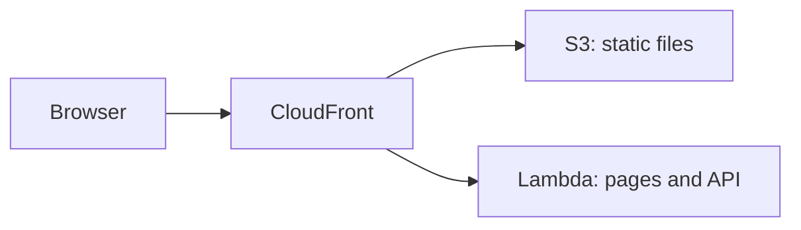

# AWS Lambda

<Badge label="Beta" color="orange" icon="rocket" />

AWS Lambda exécute le serveur de votre application à la demande. Vous n'avez
donc aucun serveur à configurer ni à maintenir en marche. Une fonction Lambda ne
sert toutefois pas les fichiers statiques de l'application. Ce guide utilise
donc trois services AWS ensemble :

- **AWS Lambda** exécute le serveur de l'application, qui gère ses pages et son
  API.
- **Amazon S3** stocke les fichiers statiques de l'application, par exemple le
  JavaScript, le CSS et les images.
- **Amazon CloudFront** fournit à l'application une seule adresse publique en
  HTTPS et envoie chaque requête au bon endroit.



Ce guide présente le déploiement d'une application autonome depuis le début.
Vous allez créer l'application, lui fournir une base de données de production et
un secret d'authentification, préparer la base de données, la construire pour
Lambda, créer la fonction, envoyer les fichiers statiques, puis placer
CloudFront devant les deux.

<Callout tone="info">

Node.js `22.22+` est requis.

</Callout>

Vous avez aussi besoin d'un compte AWS et de
l'[AWS CLI](https://docs.aws.amazon.com/cli/latest/userguide/getting-started-install.html),
installée et connectée sur votre ordinateur, avec une région par défaut
définie. Exécutez les commandes de ce guide sur votre propre ordinateur. Les
étapes 5 et 6 utilisent l'AWS CLI, et l'étape 7 utilise la console CloudFront.

## Étape 1 : Créer l'application {#step-1-create-the-app}

Créez votre nouvelle application autonome. L'exemple ci-dessous crée une
application à partir du template Chat, mais vous pouvez partir de n'importe quel
template. Placez-vous dans le dossier de l'application et installez ses
dépendances. `corepack enable` active la version de `pnpm` attendue par
l'application. Vous n'avez donc pas besoin d'installer `pnpm` vous-même.

```bash
npx --yes @agent-native/core@latest create my-app --standalone --template chat

cd my-app

corepack enable

pnpm install
```

Remplacez `my-app` par le nom de votre application si vous le souhaitez. La
suite de ce guide suppose que vous vous trouvez dans le dossier de
l'application.

<Callout tone="info">

Si ces commandes échouent avec des erreurs de dépendances pairs, une copie obsolète d'un paquet dans votre cache npx peut en être la cause. Exécutez `npx clear-npx-cache` pour vider le cache, puis relancez les commandes.

</Callout>

## Étape 2 : Configurer les secrets d'environnement {#step-2-configure-environment-secrets}

L'application lit ses paramètres de production depuis des variables
d'environnement :

| Variable             | Requise | Rôle                                                                 |
| -------------------- | ------- | -------------------------------------------------------------------- |
| `DATABASE_URL`       | Oui     | Connecte l'application à sa base de données PostgreSQL               |
| `BETTER_AUTH_SECRET` | Oui     | Signe les sessions utilisateur                                       |
| `BETTER_AUTH_URL`    | Oui     | Définit l'adresse publique utilisée pour accéder à votre application |

Les exports ci-dessous permettent aux commandes suivantes de fonctionner dans ce
shell. Avant de déployer, enregistrez ces mêmes variables dans les paramètres
d'environnement du projet ou du service chez votre hébergeur. L'étape 5
enregistre les deux premières sur la fonction Lambda, et l'étape 8 ajoute
`BETTER_AUTH_URL`.

### URL de la base de données {#database-url}

En développement local, l'application stocke ses données dans une base de
données locale lorsque `DATABASE_URL` n'est pas défini. Une application déployée
a besoin d'une vraie base de données PostgreSQL qui conserve ses données d'un
déploiement à l'autre. Lambda ne conserve pas de fichiers entre les requêtes. La
base de données doit donc se trouver en dehors de la fonction. Copiez la chaîne
de connexion fournie par votre fournisseur et exportez-la :

```bash
export DATABASE_URL='your-postgres-url-string'
```

Les [guides des fournisseurs de bases de données](/docs/neon) indiquent où
trouver la chaîne de connexion pour chaque fournisseur, y compris
[Amazon RDS for PostgreSQL](/docs/aws-rds).

<Callout tone="warning">

Choisissez un fournisseur PostgreSQL persistant, par exemple Neon, Supabase ou Amazon RDS.

</Callout>

### Secret d'authentification {#auth-secret}

Générez-le une seule fois et gardez-le identique d'un déploiement à l'autre.

L'application utilise `BETTER_AUTH_SECRET` pour signer les sessions utilisateur.
S'il change, tous les utilisateurs connectés sont déconnectés. La commande
ci-dessous génère une valeur aléatoire :

```bash
export BETTER_AUTH_SECRET="$(openssl rand -hex 32)"
```

Conservez la valeur générée en lieu sûr, par exemple dans un gestionnaire de
mots de passe. Utilisez la même valeur à chaque déploiement.

### URL publique {#public-url}

`BETTER_AUTH_URL` est l'adresse publique utilisée pour accéder à votre
application. Chez la plupart des hébergeurs, elle est facultative, car
l'application déduit son adresse de chaque requête entrante. Derrière
CloudFront, la fonction reçoit des requêtes adressées à sa propre URL Lambda au
lieu de votre adresse publique. L'application a donc besoin de cette variable
pour construire des liens de connexion et des redirections OAuth corrects.

Vous obtenez l'adresse lorsque vous créez la distribution CloudFront à
l'étape 7, et vous définissez cette variable à l'étape 8.

## Étape 3 : Migrer {#step-3-migrate}

Les migrations créent et mettent à jour les tables dont l'application a besoin
dans votre base de données. Exécutez cette commande avant le premier
déploiement :

```bash
pnpm migrate:production
```

La commande s'exécute sur votre ordinateur et se connecte à la base de données
de production avec la `DATABASE_URL` que vous avez exportée à l'étape 2.
Exécutez-la de nouveau après une mise à niveau de l'application, avant de
déployer la nouvelle version.

## Étape 4 : Construire {#step-4-build}

Construisez l'application pour Lambda :

```bash
env -u DATABASE_URL -u BETTER_AUTH_SECRET -u BETTER_AUTH_URL NITRO_PRESET=aws-lambda pnpm build
```

`NITRO_PRESET=aws-lambda` construit l'application sous forme de fonction
Lambda. Le build répartit la sortie dans deux dossiers :

<FileTree
  id="aws-lambda-build-output"
  entries={[
    {
      path: ".output/server/server.js",
      note: "Le fichier d'entrée de la fonction. Son handler est server.handler.",
    },
    {
      path: ".output/server/index.mjs",
      note: "Le code serveur de l'application, chargé par server.js.",
    },
    {
      path: ".output/server/.env",
      note: "Les variables copiées depuis votre shell lors du build.",
    },
    {
      path: ".output/public/assets/",
      note: "Les fichiers JavaScript et CSS de l'application.",
    },
    {
      path: ".output/public/manifest.json",
      note: "Les fichiers statiques de premier niveau, par exemple les icônes et le manifeste web.",
    },
  ]}
/>

Le dossier `.output/server` devient la fonction Lambda, et le dossier
`.output/public` va dans S3.

<Callout tone="warning">

Le build copie les variables de l'application depuis votre shell dans
`.output/server/.env`, qui se retrouve dans le paquet de déploiement de la
fonction. `env -u` retire les secrets de l'environnement du build, afin qu'ils
restent en dehors du paquet. Définissez-les plutôt sur la fonction, comme le
montrent l'étape 5 et l'étape 8.

</Callout>

## Étape 5 : Créer la fonction {#step-5-create-the-function}

### Créer le rôle de la fonction {#create-the-functions-role}

La fonction a besoin d'un rôle IAM qui lui permet de s'exécuter et d'écrire des
logs. Créez-le une seule fois pour l'application :

```bash
aws iam create-role --role-name my-app-lambda --assume-role-policy-document '{"Version":"2012-10-17","Statement":[{"Effect":"Allow","Principal":{"Service":"lambda.amazonaws.com"},"Action":"sts:AssumeRole"}]}'

aws iam attach-role-policy --role-name my-app-lambda --policy-arn arn:aws:iam::aws:policy/service-role/AWSLambdaBasicExecutionRole

export ROLE_ARN="$(aws iam get-role --role-name my-app-lambda --query Role.Arn --output text)"
```

### Empaqueter et créer la fonction {#package-and-create-the-function}

Compressez le dossier du serveur au format ZIP, puis créez la fonction à partir
de ce fichier :

```bash
(cd .output/server && zip -qr ../../function.zip .)

aws lambda create-function \
  --function-name my-app \
  --runtime nodejs24.x \
  --handler server.handler \
  --role "$ROLE_ARN" \
  --zip-file fileb://function.zip \
  --memory-size 1024 \
  --timeout 60 \
  --environment "$(node -e 'console.log(JSON.stringify({ Variables: { DATABASE_URL: process.env.DATABASE_URL, BETTER_AUTH_SECRET: process.env.BETTER_AUTH_SECRET } }))')"
```

`--handler server.handler` indique à Lambda le fichier d'entrée de l'étape 4. La
commande `node -e` convertit les deux secrets que vous avez exportés à
l'étape 2 dans le format attendu par l'AWS CLI. Vous n'avez donc pas besoin de
les coller à la main. `--timeout 60` accorde à chaque requête jusqu'à
60 secondes, ce qui correspond à la limite de CloudFront de l'étape 7.

Un nouveau rôle peut mettre quelques secondes à devenir utilisable. Si
`create-function` indique que le rôle ne peut pas être assumé, patientez un
instant et relancez la commande.

### Ajouter une URL de fonction {#add-a-function-url}

Une URL de fonction donne à la fonction sa propre adresse HTTPS, que CloudFront
utilise à l'étape 7 :

```bash
aws lambda create-function-url-config --function-name my-app --auth-type NONE

aws lambda add-permission --function-name my-app --statement-id FunctionUrlPublic --action lambda:InvokeFunctionUrl --principal "*" --function-url-auth-type NONE

aws lambda add-permission --function-name my-app --statement-id FunctionUrlInvoke --action lambda:InvokeFunction --principal "*" --invoked-via-function-url
```

La première commande affiche la `FunctionUrl`, qui ressemble à
`https://abc123.lambda-url.us-east-1.on.aws/`. Copiez-la pour l'étape 7. Les
deux commandes `add-permission` autorisent les requêtes à atteindre la fonction
par cette adresse.

## Étape 6 : Envoyer les fichiers statiques {#step-6-upload-the-static-files}

Créez un bucket S3 pour les fichiers statiques de l'application et copiez-les
dedans. Les noms de bucket sont partagés dans tout AWS. Ajoutez donc quelque
chose d'unique au nom :

```bash
aws s3 mb s3://my-app-assets-123456

aws s3 sync .output/public s3://my-app-assets-123456
```

Le bucket reste privé. CloudFront le lit à l'étape 7.

## Étape 7 : Placer CloudFront devant {#step-7-put-cloudfront-in-front}

Créez la distribution CloudFront dans la
[console CloudFront](https://console.aws.amazon.com/cloudfront/v4/home) :

<Steps>

### Créer la distribution

Créez une distribution et choisissez le bucket S3 de l'étape 6 comme origine.
Pour **Origin access**, choisissez
**Origin access control settings (recommended)** et créez un nouveau paramètre
de contrôle. Une fois la distribution créée, copiez la stratégie de bucket que
propose la console et ajoutez-la aux autorisations du bucket dans la console S3,
afin que CloudFront puisse lire les fichiers.

### Ajouter la fonction comme deuxième origine

Dans l'onglet **Origins** de la distribution, créez une origine. Pour
**Origin domain**, collez le nom d'hôte de l'URL de fonction de l'étape 5, sans
`https://` ni la barre oblique finale. Réglez **Protocol** sur **HTTPS only** et
**Response timeout** sur 60 secondes. N'ajoutez pas de contrôle d'accès à
l'origine à cette origine.

### Envoyer les requêtes de l'application à la fonction

Dans l'onglet **Behaviors**, modifiez le comportement **Default (\*)**. Réglez
son origine sur la fonction, **Viewer protocol policy** sur
**Redirect HTTP to HTTPS** et **Allowed HTTP methods** sur l'option qui inclut
`POST`. Réglez **Cache policy** sur **CachingDisabled** et
**Origin request policy** sur **AllViewerExceptHostHeader**.

### Envoyer les fichiers statiques vers S3

Créez un comportement avec le modèle de chemin `/assets/*` et l'origine S3, en
utilisant la stratégie de cache **CachingOptimized**. Ajoutez le même type de
comportement pour chaque fichier de premier niveau de `.output/public`, par
exemple `*.svg` et `/manifest.json` pour le template Chat.

### Copier l'adresse

Attendez la fin du déploiement de la distribution, puis copiez son nom de
domaine, qui ressemble à `d111111abcdef8.cloudfront.net`.

</Steps>

**AllViewerExceptHostHeader** transmet à la fonction les cookies, les en-têtes
et les chaînes de requête du navigateur, mais pas son en-tête `Host`. L'URL de
fonction n'accepte que les requêtes adressées à son propre nom d'hôte. C'est
pourquoi l'application a besoin de `BETTER_AUTH_URL` à l'étape suivante.

## Étape 8 : Définir l'adresse publique et déployer {#step-8-set-the-public-address-and-deploy}

Exportez l'adresse CloudFront et enregistrez les trois variables sur la
fonction :

```bash
export BETTER_AUTH_URL='https://d111111abcdef8.cloudfront.net'

aws lambda update-function-configuration \
  --function-name my-app \
  --environment "$(node -e 'console.log(JSON.stringify({ Variables: { DATABASE_URL: process.env.DATABASE_URL, BETTER_AUTH_SECRET: process.env.BETTER_AUTH_SECRET, BETTER_AUTH_URL: process.env.BETTER_AUTH_URL } }))')"
```

Cette commande remplace toutes les variables de la fonction en une seule fois.
Elle inclut donc aussi les deux de l'étape 5. Utilisez la même liste complète
chaque fois que vous modifiez une variable.

Ouvrez l'adresse CloudFront et créez le premier compte.

## Déployer les mises à jour {#deploy-updates}

Pour publier une nouvelle version, exécutez les migrations, construisez de
nouveau l'application, envoyez le nouveau code de la fonction et les fichiers
statiques, puis videz le cache de CloudFront :

```bash
pnpm migrate:production

env -u DATABASE_URL -u BETTER_AUTH_SECRET -u BETTER_AUTH_URL NITRO_PRESET=aws-lambda pnpm build

rm -f function.zip && (cd .output/server && zip -qr ../../function.zip .)

aws lambda update-function-code --function-name my-app --zip-file fileb://function.zip

aws s3 sync .output/public s3://my-app-assets-123456

aws cloudfront create-invalidation --distribution-id your-distribution-id --paths "/*"
```

`aws s3 sync` conserve les fichiers de la version précédente dans le bucket.
Les pages déjà ouvertes dans un navigateur peuvent donc encore les charger. Vous
trouverez l'ID de la distribution sur la page de la distribution dans la
console CloudFront. Les variables de la fonction restent en place. Vous n'avez
donc pas besoin de répéter l'étape 8.

## Limites {#limits}

<Accordion>

### Pourquoi l'URL de fonction est-elle publique ?

CloudFront peut signer les requêtes vers une URL de fonction avec le contrôle
d'accès à l'origine, mais Lambda exige alors que chaque requête `POST` et `PUT`
inclue un hachage de son corps dans un en-tête `x-amz-content-sha256`. Les
navigateurs n'envoient pas cet en-tête, donc les formulaires et les actions de
l'application échoueraient. L'URL de fonction reste publique, et CloudFront est
l'adresse que vous partagez.

### Combien de temps une requête peut-elle durer ?

CloudFront attend la fonction jusqu'à 60 secondes, et le délai d'expiration de
la fonction est aussi de 60 secondes. Agent-Native termine déjà un tour de chat
au bout d'environ 40 secondes et le poursuit depuis le navigateur. Les longs
tours de l'agent aboutissent donc quand même, mais en plusieurs étapes au lieu
d'une seule.

### Les réponses sont-elles diffusées en streaming ?

Non. La fonction renvoie chaque réponse en un seul bloc, et une réponse ne peut
pas dépasser 6 MB.

### Quelle taille l'application peut-elle avoir ?

Un fichier ZIP envoyé directement à Lambda ne peut pas dépasser 50 MB, et la
fonction décompressée ne peut pas dépasser 250 MB. Si `function.zip` dépasse
50 MB, envoyez-le d'abord dans S3, puis créez ou mettez à jour la fonction à
partir de là.

</Accordion>

## Et ensuite {#whats-next}

- [**Node.js**](/docs/node-js) - exécuter l'application sur une machine que vous gérez
- [**Variables d'environnement de déploiement**](/docs/deployment-environment-variables) - la liste complète des paramètres de production
- [**Déploiement**](/docs/deployment) - comparer les cibles d'hébergement et les prérequis
