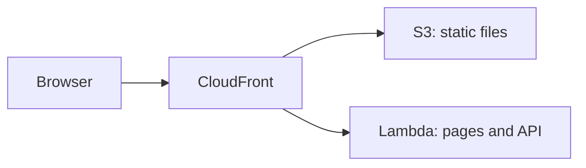

# AWS Lambda

<Badge label="Beta" color="orange" icon="rocket" />

AWS Lambda आपके ऐप का server ज़रूरत पड़ने पर चलाता है, इसलिए कोई server set up
करने या चालू रखने की ज़रूरत नहीं होती। लेकिन Lambda function ऐप की static files
serve नहीं करता, इसलिए यह guide तीन AWS services को साथ में इस्तेमाल करती है:

- **AWS Lambda** ऐप का server चलाता है, जो उसके pages और API संभालता है।
- **Amazon S3** ऐप की static files store करता है, जैसे JavaScript, CSS, और
  images।
- **Amazon CloudFront** ऐप को HTTPS के साथ एक public address देता है और हर request
  को सही जगह भेजता है।



यह guide शुरुआत से एक standalone ऐप deploy करने के चरण बताती है। आप ऐप बनाएंगे,
उसे production database और auth secret देंगे, database तैयार करेंगे, उसे Lambda के
लिए build करेंगे, function बनाएंगे, static files upload करेंगे, और फिर दोनों के आगे
CloudFront लगाएंगे।

<Callout tone="info">

Node.js `22.22+` आवश्यक है।

</Callout>

आपको एक AWS account भी चाहिए, और अपने computer पर installed और signed-in
[AWS CLI](https://docs.aws.amazon.com/cli/latest/userguide/getting-started-install.html)
भी, जिसमें default region सेट हो। इस guide के commands अपने computer पर चलाएं।
चरण 5 और 6 AWS CLI इस्तेमाल करते हैं, और चरण 7 CloudFront console इस्तेमाल करता
है।

## चरण 1: ऐप बनाएं {#step-1-create-the-app}

अपना नया standalone ऐप बनाएं। नीचे दिया गया उदाहरण Chat template से ऐप बनाता है,
लेकिन आप किसी भी template से शुरू कर सकते हैं। ऐप के folder में जाएं और उसकी
dependencies install करें। `corepack enable` वह `pnpm` version चालू करता है
जिसकी ऐप को ज़रूरत है, इसलिए आपको `pnpm` खुद install करने की ज़रूरत नहीं है।

```bash
npx --yes @agent-native/core@latest create my-app --standalone --template chat

cd my-app

corepack enable

pnpm install
```

चाहें तो `my-app` को अपने ऐप के नाम से बदल दें। इस guide का बाकी हिस्सा मानता है
कि आप ऐप के folder के अंदर हैं।

<Callout tone="info">

अगर ये commands peer dependency errors के साथ fail होते हैं, तो इसकी वजह आपके npx cache में किसी package की पुरानी copy हो सकती है। Cache साफ़ करने के लिए `npx clear-npx-cache` चलाएं, फिर commands दोबारा चलाएं।

</Callout>

## चरण 2: Environment secrets configure करें {#step-2-configure-environment-secrets}

ऐप अपनी production settings environment variables से पढ़ता है:

| Variable             | आवश्यक | उद्देश्य                                                       |
| -------------------- | ------ | -------------------------------------------------------------- |
| `DATABASE_URL`       | हां    | ऐप को उसके PostgreSQL database से connect करता है              |
| `BETTER_AUTH_SECRET` | हां    | User sessions sign करता है                                     |
| `BETTER_AUTH_URL`    | हां    | वह public address सेट करता है जिससे लोग आपके ऐप तक पहुंचते हैं |

नीचे दिए गए exports से आगे के commands इस shell में काम करते हैं। Deploy करने
से पहले, यही variables अपने host की project या service environment settings में
save करें। चरण 5 पहले दो variables को Lambda function पर save करता है, और चरण 8
`BETTER_AUTH_URL` जोड़ता है।

### Database URL {#database-url}

Local development के दौरान, `DATABASE_URL` unset होने पर ऐप data को local
database में store करता है। Deployed ऐप को एक असली PostgreSQL database चाहिए जो
deploys के बीच अपना data बनाए रखे। Lambda requests के बीच files नहीं रखता, इसलिए
database को function के बाहर होना चाहिए। अपने provider से connection string copy
करें और उसे export करें:

```bash
export DATABASE_URL='your-postgres-url-string'
```

[Database provider guides](/docs/neon) बताती हैं कि हर provider के लिए connection
string कहां मिलती है, जिसमें [Amazon RDS for PostgreSQL](/docs/aws-rds) भी शामिल
है।

<Callout tone="warning">

एक persistent PostgreSQL provider चुनें: Neon, Supabase, Amazon RDS, आदि।

</Callout>

### Auth secret {#auth-secret}

इसे एक बार generate करें और सभी deploys में इसे एक जैसा रखें।

ऐप user sessions sign करने के लिए `BETTER_AUTH_SECRET` का उपयोग करता है। अगर यह
बदलता है, तो हर signed-in user sign out हो जाता है। नीचे दिया गया command एक
random value generate करता है:

```bash
export BETTER_AUTH_SECRET="$(openssl rand -hex 32)"
```

Generate की गई value को किसी सुरक्षित जगह save करें, जैसे password manager में।
हर बार deploy करते समय यही value इस्तेमाल करें।

### Public URL {#public-url}

`BETTER_AUTH_URL` वह public address है जिससे लोग आपके ऐप तक पहुंचते हैं। ज़्यादातर
hosts पर यह वैकल्पिक है, क्योंकि ऐप हर incoming request से अपना address पता करता
है। CloudFront के पीछे, function को आपके public address के बजाय उसके अपने Lambda
URL पर भेजी गई requests मिलती हैं, इसलिए सही sign-in links और OAuth redirects
बनाने के लिए ऐप को इस variable की ज़रूरत होती है।

आपको यह address तब मिलता है जब आप चरण 7 में CloudFront distribution बनाते हैं, और
आप यह variable चरण 8 में सेट करते हैं।

## चरण 3: Migrate करें {#step-3-migrate}

Migrations आपके database में वे tables बनाती और update करती हैं जिनकी ऐप को
ज़रूरत है। पहले deploy से पहले इसे चलाएं:

```bash
pnpm migrate:production
```

यह command आपके computer पर चलता है और चरण 2 में export किए गए `DATABASE_URL` से
production database से connect करता है। ऐप upgrade करने के बाद, नया version
deploy करने से पहले इसे फिर से चलाएं।

## चरण 4: Build करें {#step-4-build}

ऐप को Lambda के लिए build करें:

```bash
env -u DATABASE_URL -u BETTER_AUTH_SECRET -u BETTER_AUTH_URL NITRO_PRESET=aws-lambda pnpm build
```

`NITRO_PRESET=aws-lambda` ऐप को Lambda function के रूप में build करता है। Build
output को दो folders में बांटता है:

<FileTree
  id="aws-lambda-build-output"
  entries={[
    {
      path: ".output/server/server.js",
      note: "Function की entry file। इसका handler server.handler है।",
    },
    {
      path: ".output/server/index.mjs",
      note: "ऐप का server code, जिसे server.js load करता है।",
    },
    {
      path: ".output/server/.env",
      note: "Build करते समय आपके shell से copy किए गए variables।",
    },
    {
      path: ".output/public/assets/",
      note: "ऐप की JavaScript और CSS files।",
    },
    {
      path: ".output/public/manifest.json",
      note: "Top-level static files, जैसे icons और web manifest।",
    },
  ]}
/>

`.output/server` folder Lambda function बनता है, और `.output/public` folder S3 पर
जाता है।

<Callout tone="warning">

Build ऐप के variables को आपके shell से `.output/server/.env` में copy करता है, जो
function के deployment package के अंदर पहुंच जाती है। `env -u` secrets को build के
environment से हटा देता है, इसलिए वे package से बाहर रहते हैं। इसके बजाय उन्हें
function पर सेट करें, जैसा चरण 5 और चरण 8 में दिखाया गया है।

</Callout>

## चरण 5: Function बनाएं {#step-5-create-the-function}

### Function का role बनाएं {#create-the-functions-role}

Function को एक IAM role चाहिए जो उसे चलने और logs लिखने दे। ऐप के लिए इसे एक बार
बनाएं:

```bash
aws iam create-role --role-name my-app-lambda --assume-role-policy-document '{"Version":"2012-10-17","Statement":[{"Effect":"Allow","Principal":{"Service":"lambda.amazonaws.com"},"Action":"sts:AssumeRole"}]}'

aws iam attach-role-policy --role-name my-app-lambda --policy-arn arn:aws:iam::aws:policy/service-role/AWSLambdaBasicExecutionRole

export ROLE_ARN="$(aws iam get-role --role-name my-app-lambda --query Role.Arn --output text)"
```

### Function को package करें और बनाएं {#package-and-create-the-function}

Server folder को zip करें, फिर zip file से function बनाएं:

```bash
(cd .output/server && zip -qr ../../function.zip .)

aws lambda create-function \
  --function-name my-app \
  --runtime nodejs24.x \
  --handler server.handler \
  --role "$ROLE_ARN" \
  --zip-file fileb://function.zip \
  --memory-size 1024 \
  --timeout 60 \
  --environment "$(node -e 'console.log(JSON.stringify({ Variables: { DATABASE_URL: process.env.DATABASE_URL, BETTER_AUTH_SECRET: process.env.BETTER_AUTH_SECRET } }))')"
```

`--handler server.handler` Lambda को चरण 4 की entry file की ओर point करता है।
`node -e` command चरण 2 में export किए गए दोनों secrets को उस format में बदलता है
जिसकी AWS CLI को ज़रूरत है, इसलिए आपको उन्हें हाथ से paste नहीं करना पड़ता।
`--timeout 60` हर request को 60 seconds तक का समय देता है, जो चरण 7 की CloudFront
limit से मेल खाता है।

नए role को इस्तेमाल लायक होने में कुछ seconds लग सकते हैं। अगर `create-function`
बताता है कि role assume नहीं किया जा सकता, तो थोड़ा रुकें और इसे फिर से चलाएं।

### Function URL जोड़ें {#add-a-function-url}

Function URL, function को उसका अपना HTTPS address देता है, जिसे CloudFront चरण 7
में इस्तेमाल करता है:

```bash
aws lambda create-function-url-config --function-name my-app --auth-type NONE

aws lambda add-permission --function-name my-app --statement-id FunctionUrlPublic --action lambda:InvokeFunctionUrl --principal "*" --function-url-auth-type NONE

aws lambda add-permission --function-name my-app --statement-id FunctionUrlInvoke --action lambda:InvokeFunction --principal "*" --invoked-via-function-url
```

पहला command `FunctionUrl` print करता है, जो
`https://abc123.lambda-url.us-east-1.on.aws/` जैसा दिखता है। इसे चरण 7 के लिए copy
करें। दोनों `add-permission` commands requests को उस address के ज़रिए function तक
पहुंचने देते हैं।

## चरण 6: Static files upload करें {#step-6-upload-the-static-files}

ऐप की static files के लिए एक S3 bucket बनाएं और उनमें files copy करें। Bucket
names पूरे AWS में shared होते हैं, इसलिए नाम में कुछ unique जोड़ें:

```bash
aws s3 mb s3://my-app-assets-123456

aws s3 sync .output/public s3://my-app-assets-123456
```

Bucket private रहता है। CloudFront चरण 7 में उससे पढ़ता है।

## चरण 7: CloudFront को आगे लगाएं {#step-7-put-cloudfront-in-front}

[CloudFront console](https://console.aws.amazon.com/cloudfront/v4/home) में
CloudFront distribution बनाएं:

<Steps>

### Distribution बनाएं

एक distribution बनाएं और उसके origin के रूप में चरण 6 का S3 bucket चुनें।
**Origin access** के लिए, **Origin access control settings (recommended)** चुनें
और एक नई control setting बनाएं। Distribution बनने के बाद, console जो bucket policy
देता है उसे copy करें और S3 console में bucket की permissions में जोड़ें, ताकि
CloudFront files पढ़ सके।

### Function को दूसरे origin के रूप में जोड़ें

Distribution के **Origins** tab पर, एक origin बनाएं। **Origin domain** के लिए,
चरण 5 के function URL का host name paste करें, `https://` या आखिरी slash के बिना।
**Protocol** को **HTTPS only** और **Response timeout** को 60 seconds पर सेट करें।
इस origin में origin access control न जोड़ें।

### ऐप requests को function पर भेजें

**Behaviors** tab पर, **Default (\*)** behavior edit करें। उसका origin function
पर, **Viewer protocol policy** को **Redirect HTTP to HTTPS** पर, और **Allowed HTTP
methods** को उस option पर सेट करें जिसमें `POST` शामिल है। **Cache policy** को
**CachingDisabled** और **Origin request policy** को **AllViewerExceptHostHeader**
पर सेट करें।

### Static files को S3 पर भेजें

Path pattern `/assets/*` और S3 origin के साथ एक behavior बनाएं, जिसमें
**CachingOptimized** cache policy हो। `.output/public` की हर top-level file के लिए
इसी तरह का behavior जोड़ें, जैसे Chat template के लिए `*.svg` और `/manifest.json`।

### Address copy करें

Distribution की deploying पूरी होने तक रुकें, फिर उसका domain name copy करें, जो
`d111111abcdef8.cloudfront.net` जैसा दिखता है।

</Steps>

**AllViewerExceptHostHeader** browser की cookies, headers, और query strings को
function तक भेजता है, लेकिन उसका `Host` header नहीं। Function URL सिर्फ अपने host
name पर भेजी गई requests स्वीकार करता है, इसीलिए अगले चरण में ऐप को
`BETTER_AUTH_URL` की ज़रूरत होती है।

## चरण 8: Public address सेट करें और deploy करें {#step-8-set-the-public-address-and-deploy}

CloudFront address export करें और तीनों variables function पर save करें:

```bash
export BETTER_AUTH_URL='https://d111111abcdef8.cloudfront.net'

aws lambda update-function-configuration \
  --function-name my-app \
  --environment "$(node -e 'console.log(JSON.stringify({ Variables: { DATABASE_URL: process.env.DATABASE_URL, BETTER_AUTH_SECRET: process.env.BETTER_AUTH_SECRET, BETTER_AUTH_URL: process.env.BETTER_AUTH_URL } }))')"
```

यह command function के सभी variables को एक साथ बदल देता है, इसलिए इसमें चरण 5 के
दोनों variables भी शामिल हैं। जब भी आप कोई variable बदलें, यही पूरी list इस्तेमाल
करें।

CloudFront address खोलें और पहला account बनाएं।

## Updates deploy करें {#deploy-updates}

नया version ship करने के लिए, migrations चलाएं, फिर से build करें, नया function
code और static files upload करें, और CloudFront का cache clear करें:

```bash
pnpm migrate:production

env -u DATABASE_URL -u BETTER_AUTH_SECRET -u BETTER_AUTH_URL NITRO_PRESET=aws-lambda pnpm build

rm -f function.zip && (cd .output/server && zip -qr ../../function.zip .)

aws lambda update-function-code --function-name my-app --zip-file fileb://function.zip

aws s3 sync .output/public s3://my-app-assets-123456

aws cloudfront create-invalidation --distribution-id your-distribution-id --paths "/*"
```

`aws s3 sync` पिछले version की files bucket में रहने देता है, इसलिए browser में
पहले से खुले pages उन्हें अब भी load कर सकते हैं। Distribution ID आपको CloudFront
console में distribution के page पर मिलेगी। Function के variables अपनी जगह बने
रहते हैं, इसलिए आपको चरण 8 दोहराने की ज़रूरत नहीं है।

## Limits {#limits}

<Accordion>

### Function URL public क्यों है?

CloudFront origin access control से function URL पर जाने वाली requests sign कर
सकता है, लेकिन तब Lambda की शर्त होती है कि हर `POST` और `PUT` request अपनी body
का hash `x-amz-content-sha256` header में भेजे। Browsers वह header नहीं भेजते,
इसलिए ऐप के forms और actions fail हो जाएंगे। Function URL public रहता है, और
CloudFront वह address है जिसे आप share करते हैं।

### एक request कितनी देर चल सकती है?

CloudFront function के लिए 60 seconds तक इंतज़ार करता है, और function का timeout
भी 60 seconds है। Agent-Native पहले से ही chat turn को लगभग 40 seconds के बाद खत्म
करता है और उसे browser से जारी रखता है, इसलिए लंबे agent turns फिर भी पूरे होते हैं,
लेकिन वे एक के बजाय कई चरणों में चलते हैं।

### क्या responses stream होते हैं?

नहीं। Function हर response एक ही बार में लौटाता है, और एक response ज़्यादा से
ज़्यादा 6 MB का हो सकता है।

### ऐप कितना बड़ा हो सकता है?

Lambda पर सीधे upload की गई zip file ज़्यादा से ज़्यादा 50 MB की हो सकती है, और
unzipped function ज़्यादा से ज़्यादा 250 MB का हो सकता है। अगर `function.zip` 50 MB
से बड़ी है, तो उसे पहले S3 पर upload करें और वहां से function बनाएं या update करें।

</Accordion>

## आगे क्या है {#whats-next}

- [**Node.js**](/docs/node-js) - ऐप को ऐसी machine पर चलाएं जिसे आप manage करते हैं
- [**तैनाती: पर्यावरण चर**](/docs/deployment-environment-variables) - production settings की पूरी सूची
- [**तैनाती**](/docs/deployment) - hosting targets और prerequisites की तुलना करें
