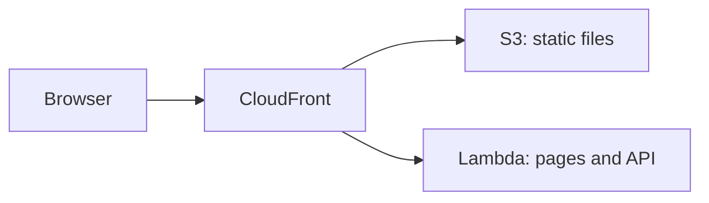

# AWS Lambda

<Badge label="Beta" color="orange" icon="rocket" />

AWS Lambda はアプリのサーバーを必要なときに実行するため、サーバーを用意したり動かし続けたりする必要はありません。ただし、Lambda 関数はアプリの静的ファイルを配信しないため、このガイドでは 3 つの AWS サービスを組み合わせて使います。

- **AWS Lambda** はアプリのサーバーを実行し、ページと API を処理します。
- **Amazon S3** は、JavaScript、CSS、画像など、アプリの静的ファイルを保存します。
- **Amazon CloudFront** は、HTTPS 対応の公開アドレスを 1 つアプリに割り当て、各リクエストを適切な場所に送ります。



このガイドでは、スタンドアロン アプリを 1 つ、ゼロからデプロイする手順を説明します。アプリを作成し、本番用のデータベースと認証シークレットを用意し、データベースを準備し、Lambda 向けにビルドし、関数を作成し、静的ファイルをアップロードしてから、その両方の前に CloudFront を配置します。

<Callout tone="info">

Node.js `22.22+` が必要です。

</Callout>

AWS アカウントと、自分のコンピューターにインストールしてサインイン済みの [AWS CLI](https://docs.aws.amazon.com/cli/latest/userguide/getting-started-install.html) も必要です。AWS CLI にはデフォルトのリージョンを設定しておいてください。このガイドのコマンドは自分のコンピューター上で実行してください。ステップ 5 と 6 では AWS CLI を使い、ステップ 7 では CloudFront コンソールを使います。

## ステップ 1: アプリを作成する {#step-1-create-the-app}

新しいスタンドアロン アプリを作成します。以下の例では Chat テンプレートからアプリを作成していますが、どのテンプレートから始めてもかまいません。アプリのフォルダーに移動し、依存関係をインストールします。`corepack enable` はアプリが想定する `pnpm` のバージョンを有効にするため、`pnpm` を自分でインストールする必要はありません。

```bash
npx --yes @agent-native/core@latest create my-app --standalone --template chat

cd my-app

corepack enable

pnpm install
```

必要に応じて、`my-app` を自分のアプリ名に置き換えてください。このガイドの以降の手順は、アプリのフォルダー内にいることを前提としています。

<Callout tone="info">

これらのコマンドがピア依存関係のエラーで失敗する場合は、npx キャッシュ内の古いパッケージが原因の可能性があります。`npx clear-npx-cache` を実行してキャッシュを消去してから、もう一度コマンドを実行してください。

</Callout>

## ステップ 2: 環境シークレットを設定する {#step-2-configure-environment-secrets}

アプリは本番用の設定を環境変数から読み取ります。

| 変数                 | 必須 | 用途                                                 |
| -------------------- | ---- | ---------------------------------------------------- |
| `DATABASE_URL`       | はい | アプリを PostgreSQL データベースに接続する           |
| `BETTER_AUTH_SECRET` | はい | ユーザー セッションに署名する                        |
| `BETTER_AUTH_URL`    | はい | ユーザーがアプリにアクセスする公開アドレスを設定する |

以下の export により、このシェルで後続のコマンドが動作するようになります。デプロイする前に、同じ変数をホストのプロジェクトまたはサービスの環境設定にも保存してください。ステップ 5 で最初の 2 つを Lambda 関数に保存し、ステップ 8 で `BETTER_AUTH_URL` を追加します。

### データベース URL {#database-url}

ローカル開発中、`DATABASE_URL` が設定されていない場合、アプリはデータをローカル データベースに保存します。デプロイしたアプリには、デプロイ後もデータを保持する本物の PostgreSQL データベースが必要です。Lambda はリクエスト間でファイルを保持しないため、データベースは関数の外に置く必要があります。プロバイダーから接続文字列をコピーし、export します。

```bash
export DATABASE_URL='your-postgres-url-string'
```

[Amazon RDS for PostgreSQL](/docs/aws-rds) を含め、各プロバイダーで接続文字列を確認する場所は、[データベース プロバイダー ガイド](/docs/neon)で説明しています。

<Callout tone="warning">

Neon、Supabase、Amazon RDS などの永続的な PostgreSQL プロバイダーを選択してください。

</Callout>

### 認証シークレット {#auth-secret}

この値は一度だけ生成し、デプロイ間で変更しないでください。

アプリは `BETTER_AUTH_SECRET` を使ってユーザー セッションに署名します。この値が変わると、サインイン中のすべてのユーザーがサインアウトされます。以下のコマンドでランダムな値を生成します。

```bash
export BETTER_AUTH_SECRET="$(openssl rand -hex 32)"
```

生成した値は、パスワード マネージャーなど、安全な場所に保存してください。デプロイのたびに同じ値を使用します。

### 公開 URL {#public-url}

`BETTER_AUTH_URL` は、ユーザーがアプリにアクセスする公開アドレスです。ほとんどのホストでは省略可能です。アプリは受信したリクエストごとに自身のアドレスを判断するためです。CloudFront の背後では、関数が受け取るリクエストは公開アドレスではなく関数自身の Lambda URL 宛てになるため、正しいサインイン リンクや OAuth のリダイレクトを作成するにはこの変数が必要です。

アドレスはステップ 7 で CloudFront ディストリビューションを作成するときに取得し、この変数はステップ 8 で設定します。

## ステップ 3: マイグレーション {#step-3-migrate}

マイグレーションは、アプリに必要なテーブルをデータベースに作成し、更新します。最初のデプロイの前にこれを実行してください。

```bash
pnpm migrate:production
```

このコマンドは自分のコンピューター上で実行され、ステップ 2 で export した `DATABASE_URL` を使って本番データベースに接続します。アプリをアップグレードした後は、新しいバージョンをデプロイする前にもう一度実行してください。

## ステップ 4: ビルド {#step-4-build}

アプリを Lambda 向けにビルドします。

```bash
env -u DATABASE_URL -u BETTER_AUTH_SECRET -u BETTER_AUTH_URL NITRO_PRESET=aws-lambda pnpm build
```

`NITRO_PRESET=aws-lambda` は、アプリを Lambda 関数としてビルドします。ビルドは出力を 2 つのフォルダーに分けます。

<FileTree
  id="aws-lambda-build-output"
  entries={[
    {
      path: ".output/server/server.js",
      note: "関数のエントリー ファイル。ハンドラーは server.handler です。",
    },
    {
      path: ".output/server/index.mjs",
      note: "server.js が読み込むアプリのサーバー コード。",
    },
    {
      path: ".output/server/.env",
      note: "ビルド時にシェルからコピーされる変数。",
    },
    {
      path: ".output/public/assets/",
      note: "アプリの JavaScript ファイルと CSS ファイル。",
    },
    {
      path: ".output/public/manifest.json",
      note: "アイコンや Web マニフェストなどの最上位の静的ファイル。",
    },
  ]}
/>

`.output/server` フォルダーが Lambda 関数になり、`.output/public` フォルダーは S3 にアップロードします。

<Callout tone="warning">

ビルドはアプリの変数をシェルから `.output/server/.env` にコピーし、このファイルは関数のデプロイ パッケージに含まれます。`env -u` はビルドの環境からシークレットを取り除くため、シークレットはパッケージに含まれません。代わりに、ステップ 5 とステップ 8 で示すように関数に設定してください。

</Callout>

## ステップ 5: 関数を作成する {#step-5-create-the-function}

### 関数のロールを作成する {#create-the-functions-role}

関数には、実行とログの書き込みを許可する IAM ロールが必要です。アプリごとに一度作成します。

```bash
aws iam create-role --role-name my-app-lambda --assume-role-policy-document '{"Version":"2012-10-17","Statement":[{"Effect":"Allow","Principal":{"Service":"lambda.amazonaws.com"},"Action":"sts:AssumeRole"}]}'

aws iam attach-role-policy --role-name my-app-lambda --policy-arn arn:aws:iam::aws:policy/service-role/AWSLambdaBasicExecutionRole

export ROLE_ARN="$(aws iam get-role --role-name my-app-lambda --query Role.Arn --output text)"
```

### パッケージ化して関数を作成する {#package-and-create-the-function}

サーバー フォルダーを zip にまとめ、その zip ファイルから関数を作成します。

```bash
(cd .output/server && zip -qr ../../function.zip .)

aws lambda create-function \
  --function-name my-app \
  --runtime nodejs24.x \
  --handler server.handler \
  --role "$ROLE_ARN" \
  --zip-file fileb://function.zip \
  --memory-size 1024 \
  --timeout 60 \
  --environment "$(node -e 'console.log(JSON.stringify({ Variables: { DATABASE_URL: process.env.DATABASE_URL, BETTER_AUTH_SECRET: process.env.BETTER_AUTH_SECRET } }))')"
```

`--handler server.handler` は、Lambda にステップ 4 のエントリー ファイルを指定します。`node -e` コマンドは、ステップ 2 で export した 2 つのシークレットを AWS CLI が想定する形式に変換するため、手で貼り付ける必要はありません。`--timeout 60` は各リクエストに最大 60 秒を与え、これはステップ 7 の CloudFront の制限と一致します。

新しいロールが使えるようになるまで数秒かかることがあります。`create-function` がロールを引き受けられないと報告した場合は、少し待ってからもう一度実行してください。

### 関数 URL を追加する {#add-a-function-url}

関数 URL は関数に専用の HTTPS アドレスを割り当てます。CloudFront はステップ 7 でこのアドレスを使います。

```bash
aws lambda create-function-url-config --function-name my-app --auth-type NONE

aws lambda add-permission --function-name my-app --statement-id FunctionUrlPublic --action lambda:InvokeFunctionUrl --principal "*" --function-url-auth-type NONE

aws lambda add-permission --function-name my-app --statement-id FunctionUrlInvoke --action lambda:InvokeFunction --principal "*" --invoked-via-function-url
```

最初のコマンドは `FunctionUrl` を出力します。これは `https://abc123.lambda-url.us-east-1.on.aws/` のような形式です。ステップ 7 のためにコピーしておいてください。2 つの `add-permission` コマンドは、そのアドレス経由でリクエストが関数に届くことを許可します。

## ステップ 6: 静的ファイルをアップロードする {#step-6-upload-the-static-files}

アプリの静的ファイル用の S3 バケットを作成し、ファイルをコピーします。バケット名は AWS 全体で共有されるため、名前に一意の文字列を加えてください。

```bash
aws s3 mb s3://my-app-assets-123456

aws s3 sync .output/public s3://my-app-assets-123456
```

バケットは非公開のままです。CloudFront はステップ 7 でこのバケットから読み取ります。

## ステップ 7: CloudFront を前面に配置する {#step-7-put-cloudfront-in-front}

[CloudFront コンソール](https://console.aws.amazon.com/cloudfront/v4/home)で CloudFront ディストリビューションを作成します。

<Steps>

### ディストリビューションを作成する

ディストリビューションを作成し、ステップ 6 の S3 バケットをオリジンとして選択します。**Origin access** では **Origin access control settings (recommended)** を選択し、新しいコントロール設定を作成します。ディストリビューションが作成されたら、コンソールに表示されるバケット ポリシーをコピーし、S3 コンソールでバケットのアクセス許可に追加して、CloudFront がファイルを読み取れるようにします。

### 関数を 2 つ目のオリジンとして追加する

ディストリビューションの **Origins** タブで、オリジンを作成します。**Origin domain** には、ステップ 5 の関数 URL のホスト名を、`https://` と末尾のスラッシュを除いて貼り付けます。**Protocol** を **HTTPS only** に、**Response timeout** を 60 秒に設定します。このオリジンにはオリジン アクセス コントロールを追加しないでください。

### アプリのリクエストを関数に送る

**Behaviors** タブで、**Default (\*)** ビヘイビアーを編集します。オリジンを関数に設定し、**Viewer protocol policy** を **Redirect HTTP to HTTPS** に、**Allowed HTTP methods** を `POST` を含むオプションに設定します。**Cache policy** を **CachingDisabled** に、**Origin request policy** を **AllViewerExceptHostHeader** に設定します。

### 静的ファイルを S3 に送る

パス パターン `/assets/*` と S3 オリジンを使い、**CachingOptimized** キャッシュ ポリシーでビヘイビアーを作成します。`.output/public` にある最上位のファイルごとに同じ種類のビヘイビアーを追加します。たとえば Chat テンプレートでは `*.svg` と `/manifest.json` です。

### アドレスをコピーする

ディストリビューションのデプロイが完了するまで待ってから、そのドメイン名をコピーします。ドメイン名は `d111111abcdef8.cloudfront.net` のような形式です。

</Steps>

**AllViewerExceptHostHeader** は、ブラウザーの Cookie、ヘッダー、クエリ文字列を関数に転送しますが、`Host` ヘッダーは転送しません。関数 URL は自身のホスト名宛てのリクエストしか受け付けないため、次のステップでアプリに `BETTER_AUTH_URL` が必要になります。

## ステップ 8: 公開アドレスを設定してデプロイする {#step-8-set-the-public-address-and-deploy}

CloudFront のアドレスを export し、3 つの変数すべてを関数に保存します。

```bash
export BETTER_AUTH_URL='https://d111111abcdef8.cloudfront.net'

aws lambda update-function-configuration \
  --function-name my-app \
  --environment "$(node -e 'console.log(JSON.stringify({ Variables: { DATABASE_URL: process.env.DATABASE_URL, BETTER_AUTH_SECRET: process.env.BETTER_AUTH_SECRET, BETTER_AUTH_URL: process.env.BETTER_AUTH_URL } }))')"
```

このコマンドは関数のすべての変数を一度に置き換えるため、ステップ 5 の 2 つの変数も含めています。変数を変更するときは、毎回同じ完全な一覧を使用してください。

CloudFront のアドレスを開き、最初のアカウントを作成します。

## 更新をデプロイする {#deploy-updates}

新しいバージョンをリリースするには、マイグレーションを実行し、もう一度ビルドし、新しい関数コードと静的ファイルをアップロードしてから、CloudFront のキャッシュをクリアします。

```bash
pnpm migrate:production

env -u DATABASE_URL -u BETTER_AUTH_SECRET -u BETTER_AUTH_URL NITRO_PRESET=aws-lambda pnpm build

rm -f function.zip && (cd .output/server && zip -qr ../../function.zip .)

aws lambda update-function-code --function-name my-app --zip-file fileb://function.zip

aws s3 sync .output/public s3://my-app-assets-123456

aws cloudfront create-invalidation --distribution-id your-distribution-id --paths "/*"
```

`aws s3 sync` は以前のバージョンのファイルをバケットに残すため、ブラウザーですでに開いているページも引き続きそれらを読み込めます。ディストリビューション ID は、CloudFront コンソールのディストリビューションのページで確認できます。関数の変数はそのまま残るため、ステップ 8 を繰り返す必要はありません。

## 制限 {#limits}

<Accordion>

### 関数 URL が公開されているのはなぜですか?

CloudFront はオリジン アクセス コントロールを使って関数 URL へのリクエストに署名できますが、その場合 Lambda は、すべての `POST` リクエストと `PUT` リクエストに、本文のハッシュを含む `x-amz-content-sha256` ヘッダーを要求します。ブラウザーはこのヘッダーを送信しないため、アプリのフォームやアクションが失敗してしまいます。そのため関数 URL は公開のままにし、共有するアドレスには CloudFront を使います。

### リクエストはどれくらいの時間実行できますか?

CloudFront は関数を最大 60 秒待ち、関数のタイムアウトも 60 秒です。Agent-Native はもともとチャットのターンを約 40 秒で終了し、ブラウザーから続行するため、長いエージェントのターンも最後まで完了しますが、1 回ではなく複数のステップに分けて実行されます。

### レスポンスはストリーミングされますか?

いいえ。関数は各レスポンスを 1 つにまとめて返し、1 つのレスポンスは最大 6 MB です。

### アプリはどれくらいの大きさにできますか?

Lambda に直接アップロードする zip ファイルは最大 50 MB、解凍後の関数は最大 250 MB です。`function.zip` が 50 MB を超える場合は、先に S3 にアップロードし、そこから関数を作成または更新してください。

</Accordion>

## 次のステップ {#whats-next}

- [**Node.js**](/docs/node-js) - 自分で管理するマシンでアプリを実行する
- [**デプロイ環境変数**](/docs/deployment-environment-variables) - 本番設定の完全な一覧
- [**デプロイ**](/docs/deployment) - ホスティング ターゲットと前提条件を比較する
