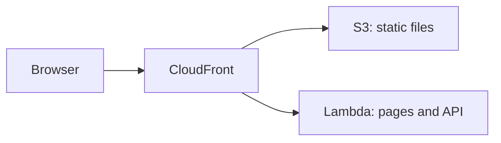

# AWS Lambda

<Badge label="Beta" color="orange" icon="rocket" />

AWS Lambda는 필요할 때 앱의 서버를 실행하므로 서버를 설정하거나 계속 실행해 둘 필요가 없습니다. 하지만 Lambda 함수는 앱의 정적 파일을 제공하지 않으므로, 이 가이드에서는 세 가지 AWS 서비스를 함께 사용합니다.

- **AWS Lambda**는 앱의 서버를 실행하며, 서버가 앱의 페이지와 API를 처리합니다.
- **Amazon S3**는 JavaScript, CSS, 이미지 같은 앱의 정적 파일을 저장합니다.
- **Amazon CloudFront**는 앱에 HTTPS가 적용된 공개 주소 하나를 제공하고 각 요청을 알맞은 곳으로 보냅니다.



이 가이드는 독립 실행형 앱 하나를 처음부터 배포하는 과정을 안내합니다. 앱을 만들고, 프로덕션 데이터베이스와 인증 시크릿을 지정하고, 데이터베이스를 준비하고, Lambda용으로 빌드하고, 함수를 만들고, 정적 파일을 업로드한 다음, 그 둘 앞에 CloudFront를 배치합니다.

<Callout tone="info">

Node.js `22.22+`가 필요합니다.

</Callout>

AWS 계정도 필요하며, 자신의 컴퓨터에 [AWS CLI](https://docs.aws.amazon.com/cli/latest/userguide/getting-started-install.html)를 설치하고 로그인한 뒤 기본 리전을 설정해 두어야 합니다. 이 가이드의 명령은 자신의 컴퓨터에서 실행하세요. 5단계와 6단계는 AWS CLI를 사용하고, 7단계는 CloudFront 콘솔을 사용합니다.

## 1단계: 앱 만들기 {#step-1-create-the-app}

새 독립 실행형 앱을 만듭니다. 아래 예시는 Chat 템플릿으로 앱을 만들지만, 어떤 템플릿으로든 시작할 수 있습니다. 앱 폴더로 이동한 뒤 의존성을 설치하세요. `corepack enable`은 앱이 기대하는 `pnpm` 버전을 활성화하므로 `pnpm`을 직접 설치할 필요가 없습니다.

```bash
npx --yes @agent-native/core@latest create my-app --standalone --template chat

cd my-app

corepack enable

pnpm install
```

원한다면 `my-app`을 원하는 앱 이름으로 바꾸세요. 이 가이드의 나머지 부분은 앱 폴더 안에 있다고 가정합니다.

<Callout tone="info">

이 명령이 피어 종속성 오류로 실패한다면 npx 캐시에 있는 오래된 패키지가 원인일 수 있습니다. `npx clear-npx-cache`를 실행해 캐시를 지운 다음 명령을 다시 실행하세요.

</Callout>

## 2단계: 환경 시크릿 구성하기 {#step-2-configure-environment-secrets}

앱은 프로덕션 설정을 환경 변수에서 읽습니다.

| 변수                 | 필수 | 용도                                          |
| -------------------- | ---- | --------------------------------------------- |
| `DATABASE_URL`       | 예   | 앱을 PostgreSQL 데이터베이스에 연결합니다     |
| `BETTER_AUTH_SECRET` | 예   | 사용자 세션에 서명합니다                      |
| `BETTER_AUTH_URL`    | 예   | 사용자가 앱에 접속하는 공개 주소를 설정합니다 |

아래의 export 명령을 실행하면 이 셸에서 이후 명령이 동작합니다. 배포하기 전에 같은 변수를 호스트의 프로젝트 또는 서비스 환경 설정에도 저장하세요. 5단계에서 처음 두 변수를 Lambda 함수에 저장하고, 8단계에서 `BETTER_AUTH_URL`을 추가합니다.

### 데이터베이스 URL {#database-url}

로컬 개발 중에는 `DATABASE_URL`이 설정되지 않으면 앱이 로컬 데이터베이스에 데이터를 저장합니다. 배포된 앱에는 배포 후에도 데이터를 유지하는 실제 PostgreSQL 데이터베이스가 필요합니다. Lambda는 요청 사이에 파일을 유지하지 않으므로 데이터베이스는 함수 밖에 있어야 합니다. 프로바이더에서 연결 문자열을 복사해 export하세요.

```bash
export DATABASE_URL='your-postgres-url-string'
```

[데이터베이스 프로바이더 가이드](/docs/neon)에서 [Amazon RDS for PostgreSQL](/docs/aws-rds)을 포함해 프로바이더별로 연결 문자열을 찾는 위치를 확인할 수 있습니다.

<Callout tone="warning">

Neon, Supabase, Amazon RDS 등 영구적인 PostgreSQL 프로바이더를 선택하세요.

</Callout>

### 인증 시크릿 {#auth-secret}

이 값은 한 번만 생성하고 배포할 때마다 바꾸지 마세요.

앱은 `BETTER_AUTH_SECRET`을 사용해 사용자 세션에 서명합니다. 이 값이 바뀌면 로그인한 모든 사용자가 로그아웃됩니다. 아래 명령은 임의의 값을 생성합니다.

```bash
export BETTER_AUTH_SECRET="$(openssl rand -hex 32)"
```

생성한 값은 비밀번호 관리자처럼 안전한 곳에 저장하세요. 배포할 때마다 같은 값을 사용합니다.

### 공개 URL {#public-url}

`BETTER_AUTH_URL`은 사용자가 앱에 접속하는 공개 주소입니다. 대부분의 호스트에서는 선택 사항인데, 앱이 들어오는 요청마다 자신의 주소를 판단하기 때문입니다. CloudFront 뒤에서는 함수가 받는 요청이 공개 주소가 아니라 함수 자체의 Lambda URL로 전달되므로, 앱이 올바른 로그인 링크와 OAuth 리디렉션을 만들려면 이 변수가 필요합니다.

주소는 7단계에서 CloudFront 배포를 만들 때 얻게 되며, 이 변수는 8단계에서 설정합니다.

## 3단계: 마이그레이션 {#step-3-migrate}

마이그레이션은 앱에 필요한 테이블을 데이터베이스에 만들고 업데이트합니다. 첫 배포 전에 이 명령을 실행하세요.

```bash
pnpm migrate:production
```

이 명령은 자신의 컴퓨터에서 실행되며, 2단계에서 export한 `DATABASE_URL`로 프로덕션 데이터베이스에 연결합니다. 앱을 업그레이드한 뒤에는 새 버전을 배포하기 전에 다시 실행하세요.

## 4단계: 빌드 {#step-4-build}

Lambda용으로 앱을 빌드합니다.

```bash
env -u DATABASE_URL -u BETTER_AUTH_SECRET -u BETTER_AUTH_URL NITRO_PRESET=aws-lambda pnpm build
```

`NITRO_PRESET=aws-lambda`는 앱을 Lambda 함수로 빌드합니다. 빌드는 출력을 두 폴더로 나눕니다.

<FileTree
  id="aws-lambda-build-output"
  entries={[
    {
      path: ".output/server/server.js",
      note: "함수의 진입 파일입니다. 핸들러는 server.handler입니다.",
    },
    {
      path: ".output/server/index.mjs",
      note: "server.js가 불러오는 앱의 서버 코드입니다.",
    },
    {
      path: ".output/server/.env",
      note: "빌드할 때 셸에서 복사되는 변수입니다.",
    },
    {
      path: ".output/public/assets/",
      note: "앱의 JavaScript 및 CSS 파일입니다.",
    },
    {
      path: ".output/public/manifest.json",
      note: "아이콘과 웹 매니페스트 같은 최상위 정적 파일입니다.",
    },
  ]}
/>

`.output/server` 폴더는 Lambda 함수가 되고, `.output/public` 폴더는 S3에 올라갑니다.

<Callout tone="warning">

빌드는 앱의 변수를 셸에서 `.output/server/.env`로 복사하며, 이 파일은 함수의 배포 패키지에 포함됩니다. `env -u`는 빌드 환경에서 시크릿을 제거하므로 시크릿이 패키지에 들어가지 않습니다. 대신 5단계와 8단계에서 보여 주는 것처럼 함수에 설정하세요.

</Callout>

## 5단계: 함수 만들기 {#step-5-create-the-function}

### 함수의 역할 만들기 {#create-the-functions-role}

함수에는 실행과 로그 쓰기를 허용하는 IAM 역할이 필요합니다. 앱마다 한 번 만드세요.

```bash
aws iam create-role --role-name my-app-lambda --assume-role-policy-document '{"Version":"2012-10-17","Statement":[{"Effect":"Allow","Principal":{"Service":"lambda.amazonaws.com"},"Action":"sts:AssumeRole"}]}'

aws iam attach-role-policy --role-name my-app-lambda --policy-arn arn:aws:iam::aws:policy/service-role/AWSLambdaBasicExecutionRole

export ROLE_ARN="$(aws iam get-role --role-name my-app-lambda --query Role.Arn --output text)"
```

### 패키징하고 함수 만들기 {#package-and-create-the-function}

서버 폴더를 zip으로 압축한 다음, 그 zip 파일로 함수를 만듭니다.

```bash
(cd .output/server && zip -qr ../../function.zip .)

aws lambda create-function \
  --function-name my-app \
  --runtime nodejs24.x \
  --handler server.handler \
  --role "$ROLE_ARN" \
  --zip-file fileb://function.zip \
  --memory-size 1024 \
  --timeout 60 \
  --environment "$(node -e 'console.log(JSON.stringify({ Variables: { DATABASE_URL: process.env.DATABASE_URL, BETTER_AUTH_SECRET: process.env.BETTER_AUTH_SECRET } }))')"
```

`--handler server.handler`는 Lambda가 4단계의 진입 파일을 사용하도록 지정합니다. `node -e` 명령은 2단계에서 export한 두 시크릿을 AWS CLI가 기대하는 형식으로 바꿔 주므로 직접 붙여 넣을 필요가 없습니다. `--timeout 60`은 각 요청에 최대 60초를 주며, 이는 7단계의 CloudFront 제한과 일치합니다.

새 역할은 사용할 수 있게 되기까지 몇 초가 걸릴 수 있습니다. `create-function`이 역할을 맡을 수 없다고 보고하면 잠시 기다린 뒤 다시 실행하세요.

### 함수 URL 추가하기 {#add-a-function-url}

함수 URL은 함수에 자체 HTTPS 주소를 제공하며, CloudFront는 7단계에서 이 주소를 사용합니다.

```bash
aws lambda create-function-url-config --function-name my-app --auth-type NONE

aws lambda add-permission --function-name my-app --statement-id FunctionUrlPublic --action lambda:InvokeFunctionUrl --principal "*" --function-url-auth-type NONE

aws lambda add-permission --function-name my-app --statement-id FunctionUrlInvoke --action lambda:InvokeFunction --principal "*" --invoked-via-function-url
```

첫 번째 명령은 `FunctionUrl`을 출력하며, 이 값은 `https://abc123.lambda-url.us-east-1.on.aws/`와 같은 형태입니다. 7단계에서 사용할 수 있도록 복사해 두세요. 두 `add-permission` 명령은 요청이 그 주소를 통해 함수에 도달할 수 있도록 허용합니다.

## 6단계: 정적 파일 업로드하기 {#step-6-upload-the-static-files}

앱의 정적 파일을 위한 S3 버킷을 만들고 파일을 복사해 넣습니다. 버킷 이름은 AWS 전체에서 공유되므로 이름에 고유한 값을 덧붙이세요.

```bash
aws s3 mb s3://my-app-assets-123456

aws s3 sync .output/public s3://my-app-assets-123456
```

버킷은 비공개로 유지됩니다. CloudFront는 7단계에서 이 버킷의 파일을 읽습니다.

## 7단계: CloudFront를 앞에 배치하기 {#step-7-put-cloudfront-in-front}

[CloudFront 콘솔](https://console.aws.amazon.com/cloudfront/v4/home)에서 CloudFront 배포를 만듭니다.

<Steps>

### 배포 만들기

배포를 만들고 6단계의 S3 버킷을 오리진으로 선택합니다. **Origin access**에서 **Origin access control settings (recommended)** 옵션을 선택하고 새 제어 설정을 만드세요. 배포가 만들어지면 콘솔에 표시되는 버킷 정책을 복사해 S3 콘솔에서 버킷 권한에 추가하여 CloudFront가 파일을 읽을 수 있게 합니다.

### 함수를 두 번째 오리진으로 추가하기

배포의 **Origins** 탭에서 오리진을 만듭니다. **Origin domain**에는 5단계의 함수 URL 호스트 이름을 `https://`와 끝의 슬래시 없이 붙여 넣으세요. **Protocol**을 **HTTPS only**로, **Response timeout**을 60초로 설정합니다. 이 오리진에는 오리진 액세스 제어를 추가하지 마세요.

### 앱 요청을 함수로 보내기

**Behaviors** 탭에서 **Default (\*)** 동작을 편집합니다. 오리진을 함수로 설정하고, **Viewer protocol policy**를 **Redirect HTTP to HTTPS**로, **Allowed HTTP methods**를 `POST`가 포함된 옵션으로 설정합니다. **Cache policy**를 **CachingDisabled**로, **Origin request policy**를 **AllViewerExceptHostHeader**로 설정하세요.

### 정적 파일을 S3로 보내기

경로 패턴 `/assets/*`와 S3 오리진을 사용하고 **CachingOptimized** 캐시 정책을 적용한 동작을 만듭니다. `.output/public`의 최상위 파일마다 같은 종류의 동작을 추가하세요. 예를 들어 Chat 템플릿에서는 `*.svg`와 `/manifest.json`입니다.

### 주소 복사하기

배포가 완료될 때까지 기다린 다음 도메인 이름을 복사합니다. 도메인 이름은 `d111111abcdef8.cloudfront.net`과 같은 형태입니다.

</Steps>

**AllViewerExceptHostHeader**는 브라우저의 쿠키, 헤더, 쿼리 문자열을 함수로 전달하지만 `Host` 헤더는 전달하지 않습니다. 함수 URL은 자체 호스트 이름으로 전달된 요청만 받으므로, 다음 단계에서 앱에 `BETTER_AUTH_URL`이 필요합니다.

## 8단계: 공개 주소 설정 및 배포하기 {#step-8-set-the-public-address-and-deploy}

CloudFront 주소를 export하고 세 변수를 모두 함수에 저장합니다.

```bash
export BETTER_AUTH_URL='https://d111111abcdef8.cloudfront.net'

aws lambda update-function-configuration \
  --function-name my-app \
  --environment "$(node -e 'console.log(JSON.stringify({ Variables: { DATABASE_URL: process.env.DATABASE_URL, BETTER_AUTH_SECRET: process.env.BETTER_AUTH_SECRET, BETTER_AUTH_URL: process.env.BETTER_AUTH_URL } }))')"
```

이 명령은 함수의 모든 변수를 한 번에 바꾸므로 5단계의 두 변수도 함께 포함합니다. 변수를 바꿀 때마다 같은 전체 목록을 사용하세요.

CloudFront 주소를 열고 첫 계정을 만듭니다.

## 업데이트 배포하기 {#deploy-updates}

새 버전을 배포하려면 마이그레이션을 실행하고, 다시 빌드하고, 새 함수 코드와 정적 파일을 업로드한 다음, CloudFront의 캐시를 지우세요.

```bash
pnpm migrate:production

env -u DATABASE_URL -u BETTER_AUTH_SECRET -u BETTER_AUTH_URL NITRO_PRESET=aws-lambda pnpm build

rm -f function.zip && (cd .output/server && zip -qr ../../function.zip .)

aws lambda update-function-code --function-name my-app --zip-file fileb://function.zip

aws s3 sync .output/public s3://my-app-assets-123456

aws cloudfront create-invalidation --distribution-id your-distribution-id --paths "/*"
```

`aws s3 sync`는 이전 버전의 파일을 버킷에 남겨 두므로, 브라우저에 이미 열려 있는 페이지도 계속 그 파일을 불러올 수 있습니다. 배포 ID는 CloudFront 콘솔의 배포 페이지에서 확인할 수 있습니다. 함수의 변수는 그대로 유지되므로 8단계를 반복할 필요가 없습니다.

## 제한 사항 {#limits}

<Accordion>

### 함수 URL이 공개되어 있는 이유는 무엇인가요?

CloudFront는 오리진 액세스 제어로 함수 URL에 대한 요청에 서명할 수 있지만, 그러면 Lambda는 모든 `POST` 및 `PUT` 요청에 본문의 해시를 담은 `x-amz-content-sha256` 헤더를 요구합니다. 브라우저는 이 헤더를 보내지 않으므로 앱의 양식과 액션이 실패하게 됩니다. 그래서 함수 URL은 공개로 유지하고, 공유하는 주소로는 CloudFront를 사용합니다.

### 요청은 얼마나 오래 실행될 수 있나요?

CloudFront는 함수를 최대 60초 동안 기다리며, 함수의 타임아웃도 60초입니다. Agent-Native는 이미 채팅 턴을 약 40초 후에 종료하고 브라우저에서 이어서 진행하므로 긴 에이전트 턴도 끝까지 완료되지만, 한 번에 실행되지 않고 여러 단계에 걸쳐 실행됩니다.

### 응답이 스트리밍되나요?

아니요. 함수는 각 응답을 한 번에 반환하며, 응답 하나는 최대 6MB까지 가능합니다.

### 앱은 얼마나 커질 수 있나요?

Lambda에 직접 업로드하는 zip 파일은 최대 50MB, 압축을 푼 함수는 최대 250MB까지 가능합니다. `function.zip`이 50MB보다 크면 먼저 S3에 업로드한 다음 그곳에서 함수를 만들거나 업데이트하세요.

</Accordion>

## 다음 단계 {#whats-next}

- [**Node.js**](/docs/node-js) - 직접 관리하는 머신에서 앱을 실행합니다
- [**배포 환경 변수**](/docs/deployment-environment-variables) - 전체 프로덕션 설정 목록
- [**배포**](/docs/deployment) - 호스팅 대상과 사전 요구 사항을 비교합니다
