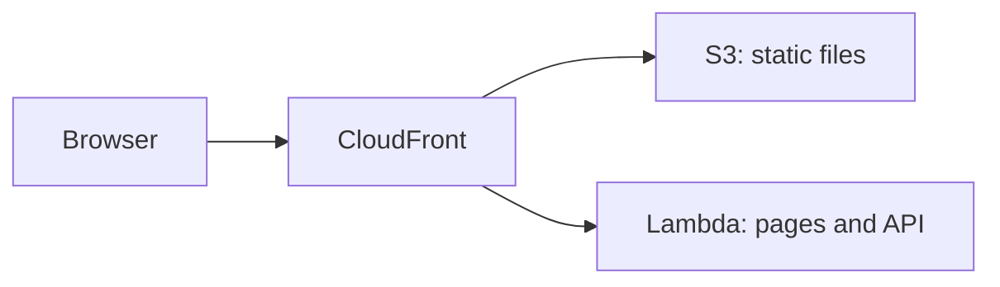

# AWS Lambda

<Badge label="Beta" color="orange" icon="rocket" />

O AWS Lambda executa o servidor do seu app sob demanda, então não há nenhum servidor para configurar
ou manter em execução. Mas uma função do Lambda não serve os arquivos estáticos do app,
então este guia usa três serviços da AWS juntos:

- **AWS Lambda** executa o servidor do app, que cuida das páginas e da API.
- **Amazon S3** armazena os arquivos estáticos do app, como JavaScript, CSS e
  imagens.
- **Amazon CloudFront** dá ao app um único endereço público com HTTPS e envia
  cada requisição para o lugar certo.



Este guia mostra como implantar um app independente do zero. Você vai
criar o app, dar a ele um banco de dados de produção e um segredo de autenticação, preparar o
banco de dados, fazer o build para o Lambda, criar a função, enviar os arquivos estáticos
e, depois, colocar o CloudFront na frente dos dois.

<Callout tone="info">

É necessário o Node.js `22.22+`.

</Callout>

Você também precisa de uma conta da AWS e da [AWS CLI](https://docs.aws.amazon.com/cli/latest/userguide/getting-started-install.html)
instalada e conectada no seu computador, com uma região padrão definida. Execute os
comandos deste guia no seu próprio computador. Os Passos 5 e 6 usam a AWS CLI, e
o Passo 7 usa o console do CloudFront.

## Passo 1: Crie o app {#step-1-create-the-app}

Crie o seu novo app independente. O exemplo abaixo cria um app a partir do template Chat,
mas você pode começar de qualquer template. Entre na pasta do app e
instale as dependências. `corepack enable` ativa a versão do `pnpm` que o app
espera, então você não precisa instalar o `pnpm` por conta própria.

```bash
npx --yes @agent-native/core@latest create my-app --standalone --template chat

cd my-app

corepack enable

pnpm install
```

Se quiser, substitua `my-app` pelo nome do seu app. O restante deste guia
considera que você está dentro da pasta do app.

<Callout tone="info">

Se esses comandos falharem com erros de dependências peer, a causa pode ser uma cópia desatualizada de um pacote no seu cache do npx. Execute `npx clear-npx-cache` para limpar o cache e depois execute os comandos novamente.

</Callout>

## Passo 2: Configure os segredos do ambiente {#step-2-configure-environment-secrets}

O app lê as configurações de produção a partir de variáveis de ambiente:

| Variável             | Obrigatória | Finalidade                                                           |
| -------------------- | ----------- | -------------------------------------------------------------------- |
| `DATABASE_URL`       | Sim         | Conecta o app ao seu banco de dados PostgreSQL                       |
| `BETTER_AUTH_SECRET` | Sim         | Assina as sessões dos usuários                                       |
| `BETTER_AUTH_URL`    | Sim         | Define o endereço público que as pessoas usam para acessar o seu app |

Os exports abaixo fazem os comandos seguintes funcionarem neste shell. Antes de
implantar, salve essas mesmas variáveis nas configurações de ambiente do projeto ou serviço do seu host.
O Passo 5 salva as duas primeiras na função do Lambda, e
o Passo 8 adiciona `BETTER_AUTH_URL`.

### URL do banco de dados {#database-url}

Durante o desenvolvimento local, o app armazena os dados em um banco de dados local quando
`DATABASE_URL` não está definida. Um app implantado precisa de um banco de dados PostgreSQL real que
mantenha os dados entre implantações. O Lambda não mantém arquivos entre requisições, então
o banco de dados precisa ficar fora da função. Copie a string de conexão
do seu provedor e exporte-a:

```bash
export DATABASE_URL='your-postgres-url-string'
```

Os [guias de provedores de banco de dados](/docs/neon) mostram onde encontrar a string de conexão
de cada provedor, incluindo o
[Amazon RDS for PostgreSQL](/docs/aws-rds).

<Callout tone="warning">

Escolha um provedor de PostgreSQL persistente, como Neon, Supabase ou Amazon RDS.

</Callout>

### Segredo de autenticação {#auth-secret}

Gere este valor uma única vez e mantenha-o igual em todas as implantações.

O app usa `BETTER_AUTH_SECRET` para assinar as sessões dos usuários. Se ele mudar, todos os
usuários conectados são desconectados. O comando abaixo gera um valor aleatório:

```bash
export BETTER_AUTH_SECRET="$(openssl rand -hex 32)"
```

Salve o valor gerado em um lugar seguro, como um gerenciador de senhas. Use o
mesmo valor sempre que implantar.

### URL pública {#public-url}

`BETTER_AUTH_URL` é o endereço público que as pessoas usam para acessar o seu app. Na maioria dos
hosts ela é opcional, porque o app descobre o próprio endereço a partir de cada requisição
recebida. Atrás do CloudFront, a função recebe requisições endereçadas à sua própria
URL do Lambda em vez do seu endereço público, então o app precisa dessa variável para
montar links de login e redirecionamentos de OAuth corretos.

Você obtém o endereço quando cria a distribuição do CloudFront no Passo 7, e
define essa variável no Passo 8.

## Passo 3: Execute as migrações {#step-3-migrate}

As migrações criam e atualizam as tabelas de que o app precisa no seu banco de dados. Execute
isto antes da primeira implantação:

```bash
pnpm migrate:production
```

O comando é executado no seu computador e se conecta ao banco de dados de produção com
a `DATABASE_URL` que você exportou no Passo 2. Execute-o novamente depois de atualizar o
app e antes de implantar a nova versão.

## Passo 4: Faça o build {#step-4-build}

Faça o build do app para o Lambda:

```bash
env -u DATABASE_URL -u BETTER_AUTH_SECRET -u BETTER_AUTH_URL NITRO_PRESET=aws-lambda pnpm build
```

`NITRO_PRESET=aws-lambda` faz o build do app como uma função do Lambda. O build divide
o resultado em duas pastas:

<FileTree
  id="aws-lambda-build-output"
  entries={[
    {
      path: ".output/server/server.js",
      note: "O arquivo de entrada da função. O handler dele é server.handler.",
    },
    {
      path: ".output/server/index.mjs",
      note: "O código do servidor do app, carregado pelo server.js.",
    },
    {
      path: ".output/server/.env",
      note: "Variáveis copiadas do seu shell quando você faz o build.",
    },
    {
      path: ".output/public/assets/",
      note: "Os arquivos JavaScript e CSS do app.",
    },
    {
      path: ".output/public/manifest.json",
      note: "Arquivos estáticos de nível superior, como os ícones e o manifesto web.",
    },
  ]}
/>

A pasta `.output/server` vira a função do Lambda, e a
pasta `.output/public` vai para o S3.

<Callout tone="warning">

O build copia as variáveis do app do seu shell para
`.output/server/.env`, que acaba dentro do pacote de implantação da função.
`env -u` remove os segredos do ambiente do build, então eles ficam fora do
pacote. Defina-os na função, como mostram o Passo 5 e o Passo 8.

</Callout>

## Passo 5: Crie a função {#step-5-create-the-function}

### Crie a role da função {#create-the-functions-role}

A função precisa de uma role do IAM que permita que ela seja executada e grave logs. Crie uma única vez
para o app:

```bash
aws iam create-role --role-name my-app-lambda --assume-role-policy-document '{"Version":"2012-10-17","Statement":[{"Effect":"Allow","Principal":{"Service":"lambda.amazonaws.com"},"Action":"sts:AssumeRole"}]}'

aws iam attach-role-policy --role-name my-app-lambda --policy-arn arn:aws:iam::aws:policy/service-role/AWSLambdaBasicExecutionRole

export ROLE_ARN="$(aws iam get-role --role-name my-app-lambda --query Role.Arn --output text)"
```

### Empacote e crie a função {#package-and-create-the-function}

Compacte a pasta do servidor em um arquivo zip e, depois, crie a função a partir desse arquivo:

```bash
(cd .output/server && zip -qr ../../function.zip .)

aws lambda create-function \
  --function-name my-app \
  --runtime nodejs24.x \
  --handler server.handler \
  --role "$ROLE_ARN" \
  --zip-file fileb://function.zip \
  --memory-size 1024 \
  --timeout 60 \
  --environment "$(node -e 'console.log(JSON.stringify({ Variables: { DATABASE_URL: process.env.DATABASE_URL, BETTER_AUTH_SECRET: process.env.BETTER_AUTH_SECRET } }))')"
```

`--handler server.handler` aponta o Lambda para o arquivo de entrada do Passo 4. O
comando `node -e` transforma os dois segredos que você exportou no Passo 2 no formato
que a AWS CLI espera, então você não precisa colá-los manualmente. `--timeout 60`
dá a cada requisição até 60 segundos, o que corresponde ao limite do CloudFront no
Passo 7.

Uma role nova pode levar alguns segundos para ficar utilizável. Se `create-function`
informar que a role não pode ser assumida, espere um pouco e execute-o novamente.

### Adicione uma URL de função {#add-a-function-url}

Uma URL de função dá à função o seu próprio endereço HTTPS, que o CloudFront usa
no Passo 7:

```bash
aws lambda create-function-url-config --function-name my-app --auth-type NONE

aws lambda add-permission --function-name my-app --statement-id FunctionUrlPublic --action lambda:InvokeFunctionUrl --principal "*" --function-url-auth-type NONE

aws lambda add-permission --function-name my-app --statement-id FunctionUrlInvoke --action lambda:InvokeFunction --principal "*" --invoked-via-function-url
```

O primeiro comando mostra a `FunctionUrl`, que se parece com
`https://abc123.lambda-url.us-east-1.on.aws/`. Copie-a para o Passo 7. Os dois
comandos `add-permission` permitem que as requisições cheguem à função por esse
endereço.

## Passo 6: Envie os arquivos estáticos {#step-6-upload-the-static-files}

Crie um bucket do S3 para os arquivos estáticos do app e copie-os para ele. Os nomes de bucket
são compartilhados em toda a AWS, então adicione algo único ao nome:

```bash
aws s3 mb s3://my-app-assets-123456

aws s3 sync .output/public s3://my-app-assets-123456
```

O bucket continua privado. O CloudFront lê a partir dele no Passo 7.

## Passo 7: Coloque o CloudFront na frente {#step-7-put-cloudfront-in-front}

Crie a distribuição do CloudFront no
[console do CloudFront](https://console.aws.amazon.com/cloudfront/v4/home):

<Steps>

### Crie a distribuição

Crie uma distribuição e escolha o bucket do S3 do Passo 6 como origem. Em
**Origin access**, escolha **Origin access control settings (recommended)** e
crie uma nova configuração de controle. Depois que a distribuição for criada, copie a
política de bucket que o console oferece e adicione-a às permissões do bucket no
console do S3, para que o CloudFront possa ler os arquivos.

### Adicione a função como segunda origem

Na aba **Origins** da distribuição, crie uma origem. Em **Origin domain**,
cole o nome de host da URL da função do Passo 5, sem `https://` e sem a
barra final. Defina **Protocol** como **HTTPS only** e **Response timeout** como
60 segundos. Não adicione um controle de acesso à origem a esta origem.

### Envie as requisições do app para a função

Na aba **Behaviors**, edite o comportamento **Default (\*)**. Defina a origem dele como
a função, **Viewer protocol policy** como **Redirect HTTP to HTTPS** e
**Allowed HTTP methods** como a opção que inclui `POST`. Defina **Cache
policy** como **CachingDisabled** e **Origin request policy** como
**AllViewerExceptHostHeader**.

### Envie os arquivos estáticos para o S3

Crie um comportamento com o padrão de caminho `/assets/*` e a origem do S3, usando
a política de cache **CachingOptimized**. Adicione o mesmo tipo de comportamento para cada
arquivo de nível superior em `.output/public`, como `*.svg` e `/manifest.json` no
template Chat.

### Copie o endereço

Espere a distribuição terminar de ser implantada e, depois, copie o nome de domínio dela, que
se parece com `d111111abcdef8.cloudfront.net`.

</Steps>

**AllViewerExceptHostHeader** encaminha para a função os cookies, os cabeçalhos e as
query strings do navegador, mas não o cabeçalho `Host`. A URL da função só
aceita requisições endereçadas ao seu próprio nome de host, e é por isso que o app precisa de
`BETTER_AUTH_URL` no próximo passo.

## Passo 8: Defina o endereço público e implante {#step-8-set-the-public-address-and-deploy}

Exporte o endereço do CloudFront e salve as três variáveis na função:

```bash
export BETTER_AUTH_URL='https://d111111abcdef8.cloudfront.net'

aws lambda update-function-configuration \
  --function-name my-app \
  --environment "$(node -e 'console.log(JSON.stringify({ Variables: { DATABASE_URL: process.env.DATABASE_URL, BETTER_AUTH_SECRET: process.env.BETTER_AUTH_SECRET, BETTER_AUTH_URL: process.env.BETTER_AUTH_URL } }))')"
```

Este comando substitui todas as variáveis da função de uma vez, então ele também inclui
as duas do Passo 5. Use a mesma lista completa sempre que alterar uma
variável.

Abra o endereço do CloudFront e crie a primeira conta.

## Implante atualizações {#deploy-updates}

Para publicar uma nova versão, execute as migrações, faça o build novamente, envie o novo
código da função e os arquivos estáticos, e limpe o cache do CloudFront:

```bash
pnpm migrate:production

env -u DATABASE_URL -u BETTER_AUTH_SECRET -u BETTER_AUTH_URL NITRO_PRESET=aws-lambda pnpm build

rm -f function.zip && (cd .output/server && zip -qr ../../function.zip .)

aws lambda update-function-code --function-name my-app --zip-file fileb://function.zip

aws s3 sync .output/public s3://my-app-assets-123456

aws cloudfront create-invalidation --distribution-id your-distribution-id --paths "/*"
```

`aws s3 sync` mantém no bucket os arquivos da versão anterior, para que as páginas que
já estão abertas em um navegador ainda consigam carregá-los. Encontre o ID da distribuição na
página da distribuição no console do CloudFront. As variáveis da função
continuam lá, então você não precisa repetir o Passo 8.

## Limites {#limits}

<Accordion>

### Por que a URL da função é pública?

O CloudFront pode assinar as requisições para uma URL de função com o controle de acesso à origem, mas
nesse caso o Lambda exige que toda requisição `POST` e `PUT` inclua um hash do
corpo em um cabeçalho `x-amz-content-sha256`. Os navegadores não enviam esse cabeçalho, então
os formulários e as ações do app falhariam. A URL da função continua pública, e
o CloudFront é o endereço que você compartilha.

### Quanto tempo uma requisição pode durar?

O CloudFront espera até 60 segundos pela função, e o tempo limite da função
também é de 60 segundos. O Agent-Native já encerra um turno de chat depois de
cerca de 40 segundos e o continua a partir do navegador, então turnos longos do agente ainda
terminam, mas são executados em várias etapas em vez de uma só.

### As respostas são enviadas por streaming?

Não. A função retorna cada resposta de uma só vez, e uma única resposta pode
ter no máximo 6 MB.

### Qual pode ser o tamanho do app?

Um arquivo zip enviado diretamente ao Lambda pode ter no máximo 50 MB, e a função
descompactada pode ter no máximo 250 MB. Se `function.zip` tiver mais de 50 MB, envie-o
primeiro para o S3 e crie ou atualize a função a partir de lá.

</Accordion>

## O que vem a seguir {#whats-next}

- [**Node.js**](/docs/node-js) - execute o app em uma máquina que você gerencia
- [**Implantação: Variáveis de Ambiente**](/docs/deployment-environment-variables) - a lista completa de configurações de produção
- [**Implantação**](/docs/deployment) - compare destinos de hospedagem e pré-requisitos
