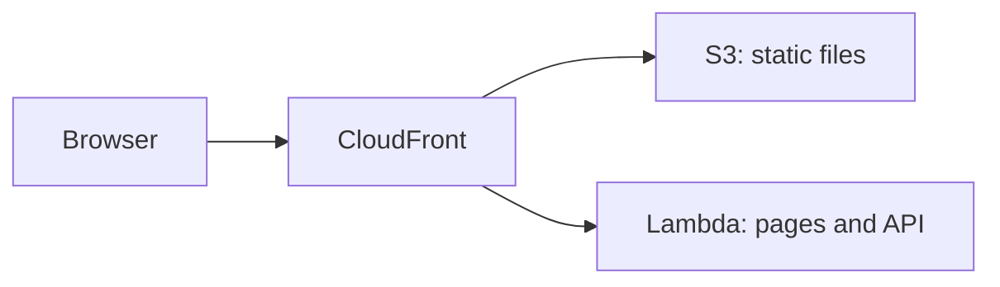

# AWS Lambda

<Badge label="Beta" color="orange" icon="rocket" />

AWS Lambda 按需运行你的应用服务器，因此无需搭建或维护服务器。不过，Lambda 函数
不会提供应用的静态文件，因此本指南会同时使用三项 AWS 服务：

- **AWS Lambda** 运行应用的服务器，由它处理应用的页面和 API。
- **Amazon S3** 存储应用的静态文件，例如 JavaScript、CSS 和图片。
- **Amazon CloudFront** 为应用提供一个支持 HTTPS 的公共地址，并把每个请求发送到
  正确的位置。



本指南将从零开始演示如何部署一个独立应用。你将创建应用，为它配置生产数据库和
身份验证密钥，准备好数据库，为 Lambda 构建应用，创建函数，上传静态文件，然后在
两者前面放置 CloudFront。

<Callout tone="info">

需要 Node.js `22.22+`。

</Callout>

你还需要一个 AWS 账户，并在你的电脑上安装并登录 [AWS CLI](https://docs.aws.amazon.com/cli/latest/userguide/getting-started-install.html)，
同时设置默认区域。请在你自己的电脑上运行本指南中的命令。第 5 步和第 6 步使用
AWS CLI，第 7 步使用 CloudFront 控制台。

## 第 1 步：创建应用 {#step-1-create-the-app}

创建新的独立应用。下面的示例基于 Chat 模板创建应用，但你可以从任何模板开始。
进入应用的文件夹并安装依赖。`corepack enable` 会启用应用所需的 `pnpm` 版本，
因此你无需自己安装 `pnpm`。

```bash
npx --yes @agent-native/core@latest create my-app --standalone --template chat

cd my-app

corepack enable

pnpm install
```

如果愿意，可以把 `my-app` 替换为你自己的应用名称。本指南的其余部分假定你位于
应用的文件夹中。

<Callout tone="info">

如果这些命令因对等依赖错误而失败，原因可能是 npx 缓存中有过时的软件包副本。运行 `npx clear-npx-cache` 清除缓存，然后重新运行这些命令。

</Callout>

## 第 2 步：配置环境密钥 {#step-2-configure-environment-secrets}

应用从环境变量中读取其生产设置：

| 变量                 | 必填 | 用途                                 |
| -------------------- | ---- | ------------------------------------ |
| `DATABASE_URL`       | 是   | 将应用连接到它的 PostgreSQL 数据库   |
| `BETTER_AUTH_SECRET` | 是   | 为用户会话签名                       |
| `BETTER_AUTH_URL`    | 是   | 设置用户访问你的应用时使用的公共地址 |

下面的 export 命令让后续命令能在当前 shell 中正常运行。部署之前，请把这些变量
同样保存到主机的项目或服务环境设置中。第 5 步会把前两个变量保存到 Lambda 函数上，
第 8 步会添加 `BETTER_AUTH_URL`。

### 数据库 URL {#database-url}

在本地开发期间，如果未设置 `DATABASE_URL`，应用会把数据存储在本地数据库中。
已部署的应用需要一个真正的 PostgreSQL 数据库，在各次部署之间保留数据。Lambda
不会在各次请求之间保留文件，因此数据库必须位于函数之外。从你的提供商处复制连接
字符串并导出它：

```bash
export DATABASE_URL='your-postgres-url-string'
```

[数据库提供商指南](/docs/neon)介绍了在每个提供商处查找连接字符串的位置，其中包括
[Amazon RDS for PostgreSQL](/docs/aws-rds)。

<Callout tone="warning">

请选择持久的 PostgreSQL 提供商，例如 Neon、Supabase、Amazon RDS 等。

</Callout>

### 身份验证密钥 {#auth-secret}

只需生成一次，并在各次部署之间保持不变。

应用使用 `BETTER_AUTH_SECRET` 为用户会话签名。如果它发生变化，所有已登录的用户
都会被登出。下面的命令会生成一个随机值：

```bash
export BETTER_AUTH_SECRET="$(openssl rand -hex 32)"
```

请把生成的值保存在安全的地方，例如密码管理器。每次部署时都使用相同的值。

### 公共 URL {#public-url}

`BETTER_AUTH_URL` 是用户访问你的应用时使用的公共地址。在大多数主机上它是可选的，
因为应用会根据每个传入请求推断自己的地址。但在 CloudFront 后面，函数收到的请求
指向的是它自己的 Lambda URL，而不是你的公共地址，因此应用需要这个变量才能生成
正确的登录链接和 OAuth 重定向。

你会在第 7 步创建 CloudFront 分配时得到这个地址，并在第 8 步设置这个变量。

## 第 3 步：迁移 {#step-3-migrate}

迁移会在你的数据库中创建和更新应用所需的表。请在首次部署之前运行此命令：

```bash
pnpm migrate:production
```

该命令在你的电脑上运行，并使用你在第 2 步中导出的 `DATABASE_URL` 连接到生产
数据库。升级应用之后、部署新版本之前，请再次运行它。

## 第 4 步：构建 {#step-4-build}

为 Lambda 构建应用：

```bash
env -u DATABASE_URL -u BETTER_AUTH_SECRET -u BETTER_AUTH_URL NITRO_PRESET=aws-lambda pnpm build
```

`NITRO_PRESET=aws-lambda` 会把应用构建为一个 Lambda 函数。构建会把输出分成两个
文件夹：

<FileTree
  id="aws-lambda-build-output"
  entries={[
    {
      path: ".output/server/server.js",
      note: "函数的入口文件。它的处理程序是 server.handler。",
    },
    {
      path: ".output/server/index.mjs",
      note: "应用的服务器代码，由 server.js 加载。",
    },
    {
      path: ".output/server/.env",
      note: "构建时从你的 shell 中复制的变量。",
    },
    {
      path: ".output/public/assets/",
      note: "应用的 JavaScript 和 CSS 文件。",
    },
    {
      path: ".output/public/manifest.json",
      note: "顶层静态文件，例如图标和 Web 清单。",
    },
  ]}
/>

`.output/server` 文件夹会成为 Lambda 函数，`.output/public` 文件夹会上传到 S3。

<Callout tone="warning">

构建会把应用的变量从你的 shell 复制到 `.output/server/.env` 中，而这个文件最终会
进入函数的部署包。`env -u` 会从构建的环境中移除这些密钥，使它们不会进入部署包。
请改为在函数上设置它们，如第 5 步和第 8 步所示。

</Callout>

## 第 5 步：创建函数 {#step-5-create-the-function}

### 创建函数的角色 {#create-the-functions-role}

函数需要一个 IAM 角色，允许它运行并写入日志。请为应用创建一次：

```bash
aws iam create-role --role-name my-app-lambda --assume-role-policy-document '{"Version":"2012-10-17","Statement":[{"Effect":"Allow","Principal":{"Service":"lambda.amazonaws.com"},"Action":"sts:AssumeRole"}]}'

aws iam attach-role-policy --role-name my-app-lambda --policy-arn arn:aws:iam::aws:policy/service-role/AWSLambdaBasicExecutionRole

export ROLE_ARN="$(aws iam get-role --role-name my-app-lambda --query Role.Arn --output text)"
```

### 打包并创建函数 {#package-and-create-the-function}

压缩服务器文件夹，然后基于该 zip 文件创建函数：

```bash
(cd .output/server && zip -qr ../../function.zip .)

aws lambda create-function \
  --function-name my-app \
  --runtime nodejs24.x \
  --handler server.handler \
  --role "$ROLE_ARN" \
  --zip-file fileb://function.zip \
  --memory-size 1024 \
  --timeout 60 \
  --environment "$(node -e 'console.log(JSON.stringify({ Variables: { DATABASE_URL: process.env.DATABASE_URL, BETTER_AUTH_SECRET: process.env.BETTER_AUTH_SECRET } }))')"
```

`--handler server.handler` 让 Lambda 指向第 4 步中的入口文件。`node -e` 命令会把
你在第 2 步中导出的两个密钥转换为 AWS CLI 需要的格式，因此你无需手动粘贴它们。
`--timeout 60` 为每个请求提供最多 60 秒的时间，与第 7 步中的 CloudFront 限制一致。

新角色可能需要几秒钟才能使用。如果 `create-function` 报告无法代入该角色，请稍等
片刻后再次运行。

### 添加函数 URL {#add-a-function-url}

函数 URL 会为函数提供它自己的 HTTPS 地址，CloudFront 会在第 7 步中使用它：

```bash
aws lambda create-function-url-config --function-name my-app --auth-type NONE

aws lambda add-permission --function-name my-app --statement-id FunctionUrlPublic --action lambda:InvokeFunctionUrl --principal "*" --function-url-auth-type NONE

aws lambda add-permission --function-name my-app --statement-id FunctionUrlInvoke --action lambda:InvokeFunction --principal "*" --invoked-via-function-url
```

第一条命令会输出 `FunctionUrl`，形如 `https://abc123.lambda-url.us-east-1.on.aws/`。
请复制它，供第 7 步使用。两条 `add-permission` 命令允许请求通过该地址到达函数。

## 第 6 步：上传静态文件 {#step-6-upload-the-static-files}

为应用的静态文件创建一个 S3 存储桶，并把文件复制进去。存储桶名称在整个 AWS 中
共享，因此请在名称中加入一些独特的内容：

```bash
aws s3 mb s3://my-app-assets-123456

aws s3 sync .output/public s3://my-app-assets-123456
```

存储桶保持私有。CloudFront 会在第 7 步中读取它。

## 第 7 步：在前面放置 CloudFront {#step-7-put-cloudfront-in-front}

在 [CloudFront 控制台](https://console.aws.amazon.com/cloudfront/v4/home)中创建
CloudFront 分配：

<Steps>

### 创建分配

创建一个分配，并选择第 6 步中的 S3 存储桶作为它的源。对于 **Origin access**，
选择 **Origin access control settings (recommended)** 并创建一个新的控制设置。
分配创建完成后，复制控制台提供的存储桶策略，并在 S3 控制台中把它添加到存储桶的
权限中，以便 CloudFront 能够读取这些文件。

### 将函数添加为第二个源

在分配的 **Origins** 选项卡中创建一个源。对于 **Origin domain**，粘贴第 5 步中
函数 URL 的主机名，不要包含 `https://` 或末尾的斜杠。把 **Protocol** 设置为
**HTTPS only**，把 **Response timeout** 设置为 60 秒。不要为这个源添加源访问控制。

### 将应用请求发送到函数

在 **Behaviors** 选项卡中，编辑 **Default (\*)** 行为。把它的源设置为函数，把
**Viewer protocol policy** 设置为 **Redirect HTTP to HTTPS**，并把
**Allowed HTTP methods** 设置为包含 `POST` 的选项。把 **Cache policy** 设置为
**CachingDisabled**，把 **Origin request policy** 设置为
**AllViewerExceptHostHeader**。

### 将静态文件发送到 S3

创建一个路径模式为 `/assets/*`、使用 S3 源的行为，并使用 **CachingOptimized**
缓存策略。为 `.output/public` 中的每个顶层文件添加同类行为，例如 Chat 模板中的
`*.svg` 和 `/manifest.json`。

### 复制地址

等待分配完成部署，然后复制它的域名，形如 `d111111abcdef8.cloudfront.net`。

</Steps>

**AllViewerExceptHostHeader** 会把浏览器的 Cookie、标头和查询字符串转发给函数，
但不包括它的 `Host` 标头。函数 URL 只接受指向它自己主机名的请求，这就是应用在
下一步中需要 `BETTER_AUTH_URL` 的原因。

## 第 8 步：设置公共地址并部署 {#step-8-set-the-public-address-and-deploy}

导出 CloudFront 地址，并把全部三个变量保存到函数上：

```bash
export BETTER_AUTH_URL='https://d111111abcdef8.cloudfront.net'

aws lambda update-function-configuration \
  --function-name my-app \
  --environment "$(node -e 'console.log(JSON.stringify({ Variables: { DATABASE_URL: process.env.DATABASE_URL, BETTER_AUTH_SECRET: process.env.BETTER_AUTH_SECRET, BETTER_AUTH_URL: process.env.BETTER_AUTH_URL } }))')"
```

该命令会一次性替换函数的所有变量，因此它也包含第 5 步中的两个变量。每次更改
变量时，都请使用同样的完整列表。

打开 CloudFront 地址并创建第一个账户。

## 部署更新 {#deploy-updates}

要发布新版本，请运行迁移，再次构建，上传新的函数代码和静态文件，然后清除
CloudFront 的缓存：

```bash
pnpm migrate:production

env -u DATABASE_URL -u BETTER_AUTH_SECRET -u BETTER_AUTH_URL NITRO_PRESET=aws-lambda pnpm build

rm -f function.zip && (cd .output/server && zip -qr ../../function.zip .)

aws lambda update-function-code --function-name my-app --zip-file fileb://function.zip

aws s3 sync .output/public s3://my-app-assets-123456

aws cloudfront create-invalidation --distribution-id your-distribution-id --paths "/*"
```

`aws s3 sync` 会在存储桶中保留上一个版本的文件，因此已经在浏览器中打开的页面
仍然可以加载它们。你可以在 CloudFront 控制台中该分配的页面上找到分配 ID。函数的
变量会保留在原处，因此你无需重复第 8 步。

## 限制 {#limits}

<Accordion>

### 为什么函数 URL 是公开的？

CloudFront 可以使用源访问控制为发往函数 URL 的请求签名，但这样一来，Lambda 会
要求每个 `POST` 和 `PUT` 请求都在 `x-amz-content-sha256` 标头中包含其请求体的
哈希值。浏览器不会发送这个标头，因此应用的表单和操作会失败。函数 URL 保持公开，
而 CloudFront 才是你分享的地址。

### 一个请求可以运行多长时间？

CloudFront 最多等待函数 60 秒，函数的超时时间也是 60 秒。Agent-Native 已经会在
大约 40 秒后结束一次对话轮次，并从浏览器中继续它，因此较长的智能体轮次仍然能够
完成，只是会分多个步骤运行，而不是一次完成。

### 响应是流式传输的吗？

不是。函数会一次性返回每个响应，单个响应最大为 6 MB。

### 应用最大可以多大？

直接上传到 Lambda 的 zip 文件最大为 50 MB，解压后的函数最大为 250 MB。如果
`function.zip` 大于 50 MB，请先把它上传到 S3，再从那里创建或更新函数。

</Accordion>

## 下一步 {#whats-next}

- [**Node.js**](/docs/node-js) - 在你管理的机器上运行应用
- [**部署环境变量**](/docs/deployment-environment-variables) - 生产设置的完整列表
- [**部署**](/docs/deployment) - 比较各个托管目标及其前提条件
