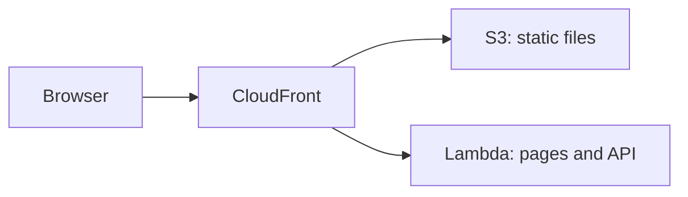

# AWS Lambda

<Badge label="Beta" color="orange" icon="rocket" />

AWS Lambda 會依需求執行應用程式的伺服器，因此不需要架設或維護伺服器。不過，Lambda
函式不會提供應用程式的靜態檔案，因此本指南會同時使用三項 AWS 服務：

- **AWS Lambda** 執行應用程式的伺服器，由它處理應用程式的頁面和 API。
- **Amazon S3** 儲存應用程式的靜態檔案，例如 JavaScript、CSS 和圖片。
- **Amazon CloudFront** 為應用程式提供一個支援 HTTPS 的公開網址，並把每個請求傳送到
  正確的位置。



本指南會從頭開始示範如何部署一個獨立應用程式。你將建立應用程式，為它設定正式環境
資料庫和驗證密鑰，準備好資料庫，為 Lambda 建置應用程式，建立函式，上傳靜態檔案，
然後在兩者前面放置 CloudFront。

<Callout tone="info">

需要 Node.js `22.22+`。

</Callout>

你還需要一個 AWS 帳號，並在你的電腦上安裝並登入 [AWS CLI](https://docs.aws.amazon.com/cli/latest/userguide/getting-started-install.html)，
同時設定預設區域。請在你自己的電腦上執行本指南中的指令。步驟 5 和步驟 6 使用
AWS CLI，步驟 7 使用 CloudFront 主控台。

## 步驟 1：建立應用程式 {#step-1-create-the-app}

建立新的獨立應用程式。下面的範例以 Chat 範本建立應用程式，但你可以從任何範本開始。
進入應用程式的資料夾並安裝相依套件。`corepack enable` 會啟用應用程式所需的 `pnpm`
版本，因此你不需要自行安裝 `pnpm`。

```bash
npx --yes @agent-native/core@latest create my-app --standalone --template chat

cd my-app

corepack enable

pnpm install
```

如果你想要，可以把 `my-app` 換成你自己的應用程式名稱。本指南的其餘部分假設你位於
應用程式的資料夾中。

<Callout tone="info">

如果這些指令因對等相依性錯誤而失敗，原因可能是 npx 快取中有過時的套件副本。執行 `npx clear-npx-cache` 清除快取，然後重新執行這些指令。

</Callout>

## 步驟 2：設定環境密鑰 {#step-2-configure-environment-secrets}

應用程式會從環境變數讀取其正式環境設定：

| 變數                 | 必要 | 用途                                       |
| -------------------- | ---- | ------------------------------------------ |
| `DATABASE_URL`       | 是   | 將應用程式連線到它的 PostgreSQL 資料庫     |
| `BETTER_AUTH_SECRET` | 是   | 為使用者工作階段簽章                       |
| `BETTER_AUTH_URL`    | 是   | 設定使用者連到你的應用程式時使用的公開網址 |

下面的 export 指令讓後續指令能在目前的 shell 中正常運作。部署之前，請把這些變數
同樣儲存到主機的專案或服務環境設定中。步驟 5 會把前兩個變數儲存到 Lambda 函式上，
步驟 8 會加入 `BETTER_AUTH_URL`。

### 資料庫 URL {#database-url}

在本機開發期間，如果未設定 `DATABASE_URL`，應用程式會把資料儲存在本機資料庫中。
已部署的應用程式需要一個真正的 PostgreSQL 資料庫，在每次部署之間保留資料。Lambda
不會在每次請求之間保留檔案，因此資料庫必須位於函式之外。從你的提供者複製連線字串並
匯出它：

```bash
export DATABASE_URL='your-postgres-url-string'
```

[資料庫提供者指南](/docs/neon)說明了在各個提供者處找到連線字串的位置，其中包括
[Amazon RDS for PostgreSQL](/docs/aws-rds)。

<Callout tone="warning">

請選擇持久性的 PostgreSQL 提供者，例如 Neon、Supabase、Amazon RDS 等。

</Callout>

### 驗證密鑰 {#auth-secret}

只需要產生一次，並在每次部署之間保持不變。

應用程式使用 `BETTER_AUTH_SECRET` 為使用者工作階段簽章。如果它變更了，所有已登入的
使用者都會被登出。下面的指令會產生一個隨機值：

```bash
export BETTER_AUTH_SECRET="$(openssl rand -hex 32)"
```

請把產生的值儲存在安全的地方，例如密碼管理工具。每次部署時都使用相同的值。

### 公開 URL {#public-url}

`BETTER_AUTH_URL` 是使用者連到你的應用程式時使用的公開網址。在大多數主機上它是選用的，
因為應用程式會根據每個傳入的請求推斷自己的網址。但在 CloudFront 後方，函式收到的請求
指向的是它自己的 Lambda URL，而不是你的公開網址，因此應用程式需要這個變數才能產生
正確的登入連結和 OAuth 重新導向。

你會在步驟 7 建立 CloudFront 散發時取得這個網址，並在步驟 8 設定這個變數。

## 步驟 3：遷移 {#step-3-migrate}

遷移會在你的資料庫中建立和更新應用程式所需的資料表。請在第一次部署之前執行此指令：

```bash
pnpm migrate:production
```

這個指令會在你的電腦上執行，並使用你在步驟 2 中匯出的 `DATABASE_URL` 連線到正式
環境資料庫。升級應用程式之後、部署新版本之前，請再執行一次。

## 步驟 4：建置 {#step-4-build}

為 Lambda 建置應用程式：

```bash
env -u DATABASE_URL -u BETTER_AUTH_SECRET -u BETTER_AUTH_URL NITRO_PRESET=aws-lambda pnpm build
```

`NITRO_PRESET=aws-lambda` 會把應用程式建置為一個 Lambda 函式。建置會把輸出分成兩個
資料夾：

<FileTree
  id="aws-lambda-build-output"
  entries={[
    {
      path: ".output/server/server.js",
      note: "函式的進入點檔案。它的處理常式是 server.handler。",
    },
    {
      path: ".output/server/index.mjs",
      note: "應用程式的伺服器程式碼，由 server.js 載入。",
    },
    {
      path: ".output/server/.env",
      note: "建置時從你的 shell 複製的變數。",
    },
    {
      path: ".output/public/assets/",
      note: "應用程式的 JavaScript 和 CSS 檔案。",
    },
    {
      path: ".output/public/manifest.json",
      note: "最上層的靜態檔案，例如圖示和 Web 資訊清單。",
    },
  ]}
/>

`.output/server` 資料夾會成為 Lambda 函式，`.output/public` 資料夾會上傳到 S3。

<Callout tone="warning">

建置會把應用程式的變數從你的 shell 複製到 `.output/server/.env`，而這個檔案最後會
進入函式的部署套件。`env -u` 會從建置的環境中移除這些密鑰，讓它們不會進入部署套件。
請改為在函式上設定它們，如步驟 5 和步驟 8 所示。

</Callout>

## 步驟 5：建立函式 {#step-5-create-the-function}

### 建立函式的角色 {#create-the-functions-role}

函式需要一個 IAM 角色，允許它執行並寫入記錄。請為應用程式建立一次：

```bash
aws iam create-role --role-name my-app-lambda --assume-role-policy-document '{"Version":"2012-10-17","Statement":[{"Effect":"Allow","Principal":{"Service":"lambda.amazonaws.com"},"Action":"sts:AssumeRole"}]}'

aws iam attach-role-policy --role-name my-app-lambda --policy-arn arn:aws:iam::aws:policy/service-role/AWSLambdaBasicExecutionRole

export ROLE_ARN="$(aws iam get-role --role-name my-app-lambda --query Role.Arn --output text)"
```

### 封裝並建立函式 {#package-and-create-the-function}

壓縮伺服器資料夾，然後以該 zip 檔案建立函式：

```bash
(cd .output/server && zip -qr ../../function.zip .)

aws lambda create-function \
  --function-name my-app \
  --runtime nodejs24.x \
  --handler server.handler \
  --role "$ROLE_ARN" \
  --zip-file fileb://function.zip \
  --memory-size 1024 \
  --timeout 60 \
  --environment "$(node -e 'console.log(JSON.stringify({ Variables: { DATABASE_URL: process.env.DATABASE_URL, BETTER_AUTH_SECRET: process.env.BETTER_AUTH_SECRET } }))')"
```

`--handler server.handler` 讓 Lambda 指向步驟 4 中的進入點檔案。`node -e` 指令會把
你在步驟 2 中匯出的兩個密鑰轉換成 AWS CLI 需要的格式，因此你不需要手動貼上它們。
`--timeout 60` 讓每個請求最多有 60 秒的時間，與步驟 7 中的 CloudFront 限制一致。

新角色可能需要幾秒鐘才能使用。如果 `create-function` 回報無法擔任該角色，請稍等
片刻後再執行一次。

### 加入函式 URL {#add-a-function-url}

函式 URL 會為函式提供它自己的 HTTPS 網址，CloudFront 會在步驟 7 中使用它：

```bash
aws lambda create-function-url-config --function-name my-app --auth-type NONE

aws lambda add-permission --function-name my-app --statement-id FunctionUrlPublic --action lambda:InvokeFunctionUrl --principal "*" --function-url-auth-type NONE

aws lambda add-permission --function-name my-app --statement-id FunctionUrlInvoke --action lambda:InvokeFunction --principal "*" --invoked-via-function-url
```

第一個指令會輸出 `FunctionUrl`，看起來像 `https://abc123.lambda-url.us-east-1.on.aws/`。
請複製它，供步驟 7 使用。兩個 `add-permission` 指令允許請求透過該網址到達函式。

## 步驟 6：上傳靜態檔案 {#step-6-upload-the-static-files}

為應用程式的靜態檔案建立一個 S3 儲存貯體，並把檔案複製進去。儲存貯體名稱在整個 AWS
中共用，因此請在名稱中加入一些獨特的內容：

```bash
aws s3 mb s3://my-app-assets-123456

aws s3 sync .output/public s3://my-app-assets-123456
```

儲存貯體會保持私有。CloudFront 會在步驟 7 中讀取它。

## 步驟 7：在前面放置 CloudFront {#step-7-put-cloudfront-in-front}

在 [CloudFront 主控台](https://console.aws.amazon.com/cloudfront/v4/home)中建立
CloudFront 散發：

<Steps>

### 建立散發

建立一個散發，並選擇步驟 6 中的 S3 儲存貯體作為它的來源。在 **Origin access** 中，
選擇 **Origin access control settings (recommended)** 並建立新的控制設定。
散發建立完成後，複製主控台提供的儲存貯體政策，並在 S3 主控台中把它加入儲存貯體的
權限，讓 CloudFront 能夠讀取這些檔案。

### 將函式加入為第二個來源

在散發的 **Origins** 分頁中建立一個來源。在 **Origin domain** 中，貼上步驟 5 中
函式 URL 的主機名稱，不要包含 `https://` 或結尾的斜線。將 **Protocol** 設定為
**HTTPS only**，將 **Response timeout** 設定為 60 秒。不要為這個來源加入來源存取控制。

### 將應用程式請求傳送到函式

在 **Behaviors** 分頁中，編輯 **Default (\*)** 行為。將它的來源設定為函式，將
**Viewer protocol policy** 設定為 **Redirect HTTP to HTTPS**，並將
**Allowed HTTP methods** 設定為包含 `POST` 的選項。將 **Cache policy** 設定為
**CachingDisabled**，將 **Origin request policy** 設定為
**AllViewerExceptHostHeader**。

### 將靜態檔案傳送到 S3

建立一個路徑模式為 `/assets/*`、使用 S3 來源的行為，並使用 **CachingOptimized**
快取政策。為 `.output/public` 中的每個最上層檔案加入同類的行為，例如 Chat 範本中的
`*.svg` 和 `/manifest.json`。

### 複製網址

等待散發完成部署，然後複製它的網域名稱，看起來像 `d111111abcdef8.cloudfront.net`。

</Steps>

**AllViewerExceptHostHeader** 會把瀏覽器的 Cookie、標頭和查詢字串轉送給函式，
但不包括它的 `Host` 標頭。函式 URL 只接受指向它自己主機名稱的請求，這就是應用程式在
下一步中需要 `BETTER_AUTH_URL` 的原因。

## 步驟 8：設定公開網址並部署 {#step-8-set-the-public-address-and-deploy}

匯出 CloudFront 網址，並把全部三個變數儲存到函式上：

```bash
export BETTER_AUTH_URL='https://d111111abcdef8.cloudfront.net'

aws lambda update-function-configuration \
  --function-name my-app \
  --environment "$(node -e 'console.log(JSON.stringify({ Variables: { DATABASE_URL: process.env.DATABASE_URL, BETTER_AUTH_SECRET: process.env.BETTER_AUTH_SECRET, BETTER_AUTH_URL: process.env.BETTER_AUTH_URL } }))')"
```

這個指令會一次取代函式的所有變數，因此它也包含步驟 5 中的兩個變數。每次變更變數時，
都請使用同樣的完整清單。

開啟 CloudFront 網址並建立第一個帳號。

## 部署更新 {#deploy-updates}

若要發布新版本，請執行遷移，再次建置，上傳新的函式程式碼和靜態檔案，然後清除
CloudFront 的快取：

```bash
pnpm migrate:production

env -u DATABASE_URL -u BETTER_AUTH_SECRET -u BETTER_AUTH_URL NITRO_PRESET=aws-lambda pnpm build

rm -f function.zip && (cd .output/server && zip -qr ../../function.zip .)

aws lambda update-function-code --function-name my-app --zip-file fileb://function.zip

aws s3 sync .output/public s3://my-app-assets-123456

aws cloudfront create-invalidation --distribution-id your-distribution-id --paths "/*"
```

`aws s3 sync` 會在儲存貯體中保留上一個版本的檔案，因此已經在瀏覽器中開啟的頁面
仍然可以載入它們。你可以在 CloudFront 主控台中該散發的頁面上找到散發 ID。函式的
變數會保留在原處，因此你不需要重複步驟 8。

## 限制 {#limits}

<Accordion>

### 為什麼函式 URL 是公開的？

CloudFront 可以使用來源存取控制為傳送到函式 URL 的請求簽章，但這樣一來，Lambda 會
要求每個 `POST` 和 `PUT` 請求都在 `x-amz-content-sha256` 標頭中包含其請求本文的
雜湊值。瀏覽器不會傳送這個標頭，因此應用程式的表單和動作會失敗。函式 URL 會保持公開，
而 CloudFront 才是你分享的網址。

### 一個請求可以執行多久？

CloudFront 最多會等待函式 60 秒，函式的逾時時間也是 60 秒。Agent-Native 已經會在
大約 40 秒後結束一次對話回合，並從瀏覽器繼續執行，因此較長的代理程式回合仍然能夠
完成，只是會分成多個步驟執行，而不是一次完成。

### 回應是串流傳輸的嗎？

不是。函式會一次傳回每個回應，單一回應最大為 6 MB。

### 應用程式最大可以多大？

直接上傳到 Lambda 的 zip 檔案最大為 50 MB，解壓縮後的函式最大為 250 MB。如果
`function.zip` 大於 50 MB，請先把它上傳到 S3，再從那裡建立或更新函式。

</Accordion>

## 接下來呢 {#whats-next}

- [**Node.js**](/docs/node-js) - 在你管理的機器上執行應用程式
- [**部署環境變數**](/docs/deployment-environment-variables) - 正式環境設定的完整清單
- [**部署**](/docs/deployment) - 比較各個代管目標及其先決條件
